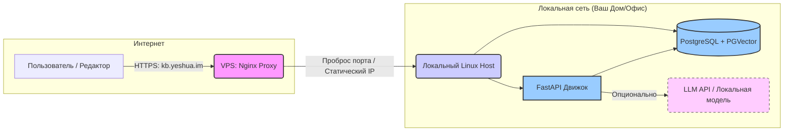
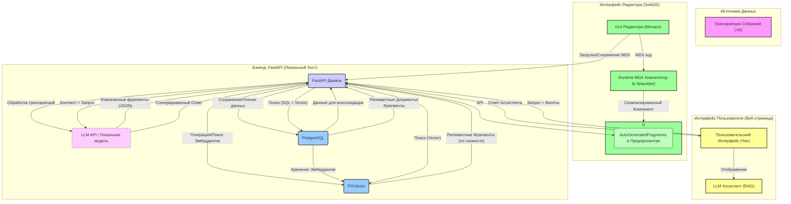

``` D
Разрабатываю структуру и синтаксис mdx документов для базы знаний древне ранне евангельского направления. Вижу что-то типа xml, мне нужны английские названия тегов
```

Да, MDX идеально для этого подходит. То, что вы видите как XML, — это **JSX-компоненты** (custom components), которые MDX позволяет встраивать прямо в Markdown. Это дает огромную гибкость для создания структурированной базы знаний.

Вот предлагаемая структура и набор английских названий тегов (компонентов), которые могут быть полезны для вашей тематики.

---

## Основная концепция MDX

MDX-файл — это, по сути, Markdown-файл, в котором вы можете делать две новые вещи:

1. **Импортировать компоненты:** В самом верху файла вы импортируете заранее созданные компоненты (например, написанные на React или Vue).
    
2. **Использовать компоненты:** Вы вставляете их в текст, как если бы это были HTML-теги.
    

---

## Пример структуры MDX-документа

Вот как мог бы выглядеть ваш `article.mdx`. Обратите внимание на `import` вверху и на использование тегов `<...>` в тексте.

```
---
title: 'The Doctrine of Logos in Early Christianity'
tags: ['Theology', 'Christology', 'John', 'Early Church']
author: 'John Doe'
---

import { BibleVerse, Definition, Callout, Figure, Commentary, TimelineEvent } from './KBComponents';

# The Doctrine of the Logos (The Word)

The concept of the *Logos* is central to early evangelical thought,
providing a bridge between Hebrew wisdom literature and Greek philosophy.

<Definition term="Logos (Λόγος)">
A Greek term meaning "word," "reason," or "plan." In Johannine theology,
it refers to the divine, pre-existent Christ, the agent of creation
and the ultimate revelation of God.
</Definition>

## Biblical Foundation

The most famous exposition comes from the Gospel of John.

<BibleVerse book="John" chapter="1" verse="1">
In the beginning was the Word, and the Word was with God, and the Word was God.
</BibleVerse>

<BibleVerse book="John" chapter="1" verse="14" translation="KJV">
And the Word was made flesh, and dwelt among us, (and we beheld his glory,
the glory as of the only begotten of the Father,) full of grace and truth.
</BibleVerse>

<Commentary on="John 1:1, 1:14">
This passage establishes the core tenets of Christology: the pre-existence
of Christ, His divinity ("was God"), and His incarnation ("became flesh").
This countered early docetic and gnostic views.
</Commentary>

## Key Figures

<Figure name="Justin Martyr" dates="c. 100 – c. 165 AD">
An early Christian apologist who prominently used the *Logos* concept
to argue for the rationality of the Christian faith to a Greco-Roman audience.
He described Christ as the "Logos in whom every race of men shared."
</Figure>

## Historical Context

<Callout type="warning" title="Gnostic Misinterpretation">
It is crucial to distinguish the Johannine *Logos* from many Gnostic
conceptions, which viewed the *Logos* as a lesser emanation (aeon)
from a high God, and the material world ("flesh") as inherently evil.
</Callout>

<TimelineEvent date="325 AD" title="First Council of Nicaea">
The ideas of *Logos* were foundational in the debates against Arianism,
leading to the formulation of the Nicene Creed, which affirmed
Christ as "God from God, Light from Light, true God from true God."
</TimelineEvent>
```

---

## Идеи для английских тегов (компонентов)

Вот список тегов, которые кажутся наиболее релевантными для богословской базы знаний.

### `<BibleVerse>`

**Назначение:** Форматированная цитата из Священного Писания. **Атрибуты (Props):**

- `book` (string): Название книги (e.g., "Genesis", "John").

- `chapter` (string | number): Глава.

- `verse` (string | number): Стих или диапазон стихов (e.g., "16", "16-18").

- `translation` (string, optional): Указание перевода (e.g., "KJV", "NIV", "LXX"). **Пример использования:**


```
<BibleVerse book="Ephesians" chapter="2" verse="8-9">
For by grace you have been saved through faith. And this is not your own doing;
it is the gift of God, not a result of works, so that no one may boast.
</BibleVerse>
```

### `<Definition>`

**Назначение:** Выделение и объяснение ключевого термина (богословского, греческого, еврейского). **Атрибуты (Props):**

- `term` (string): Сам термин (e.g., "Agape", "Kenosis").
    
- `original` (string, optional): Оригинальное написание (e.g., "ἀγάπη"). **Пример использования:**
    

```
<Definition term="Agape" original="ἀγάπη">
Unconditional, self-sacrificing love; the highest form of love
and a central attribute of God.
</Definition>
```

###  `<Callout>`

**Назначение:** Блок для привлечения внимания: заметка, предупреждение, спорный момент. **Атрибуты (Props):**

- `type` (string): Тип блока (e.g., "info", "warning", "doctrine", "interpretation").
    
- `title` (string, optional): Заголовок для блока. **Пример использования:**
    

```
<Callout type="warning" title="Arian Controversy">
This viewpoint reflects an Arian understanding of Christ's nature,
which was declared heretical at the Council of Nicaea.
</Callout>

<Callout type="info">
This practice is specific to the Didache and may not
reflect universal practice at the time.
</Callout>
```

### `<Figure>` или `<PersonProfile>`

**Назначение:** Краткая карточка-биография ключевой исторической фигуры. **Атрибуты (Props):**

- `name` (string): Имя (e.g., "Polycarp of Smyrna").
    
- `dates` (string): Даты жизни (e.g., "c. 69 – c. 155 AD").
    
- `role` (string, optional): Роль (e.g., "Bishop", "Martyr", "Church Father"). **Пример использования:**
    

```
<Figure name="Polycarp of Smyrna" dates="c. 69 – c. 155 AD" role="Bishop and Martyr">
A disciple of John the Apostle and an important link between
the Apostolic Age and later generations.
</Figure>
```

### `<Commentary>` или `<Exegesis>`

**Назначение:** Блок для толкования, экзегетического разбора или комментария. **Атрибуты (Props):**

- `on` (string): На что дается комментарий (e.g., "Genesis 3:15", "The Parable of the Sower"). **Пример использования:**
    

```
<Commentary on="Romans 5:12">
Paul's argument here...
</Commentary>
```

### `<TimelineEvent>`

**Назначение:** Элемент для вставки в хронологическую шкалу или просто для выделения события. **Атрибуты (Props):**

- `date` (string): Дата (e.g., "c. 33 AD", "313 AD").
    
- `title` (string): Название события. **Пример использования:**
    

```
<TimelineEvent date="313 AD" title="Edict of Milan">
Constantine the Great officially ended the persecution
of Christians within the Roman Empire.
</TimelineEvent>
```

### `<SeeAlso>`

**Назначение:** Блок для перекрестных ссылок на другие статьи в базе знаний. **Пример использования:** (Этот компонент может просто стилизовать обычный Markdown-список внутри себя).

```
<SeeAlso>
- [The Nature of the Trinity](/doctrine/trinity)
- [Early Gnostic Sects](/history/gnosticism)
- [The Council of Nicaea](/events/nicaea)
</SeeAlso>
```

**Важное замечание:** Сами по себе эти теги ничего не будут делать. Их нужно "создать" (обычно в виде .js или .tsx файлов, например, `BibleVerse.js`) и импортировать. MDX предоставляет "синтаксис", а вы предоставляете "реализацию" (логику и стили) для каждого тега

---

``` D
Прекрасно, но пример текстов хотелось бы переделать под русский язык
```


Понял вас. Это совершенно логичный подход: **названия тегов (компонентов) остаются на английском** (т.к. это, по сути, код), а все **содержимое — на русском**.

Вот тот же самый пример, но полностью адаптированный под русский язык.

---

## Пример структуры MDX-документа (на русском)

Так мог бы выглядеть ваш файл `uchenie-o-logose.mdx`.

```
---
title: 'Учение о Логосе в раннем христианстве'
tags: ['Богословие', 'Христология', 'Иоанн', 'Ранняя Церковь']
author: 'Редакция'
---

import { BibleVerse, Definition, Callout, Figure, Commentary, TimelineEvent } from './KBComponents';

# Учение о Логосе (Слове)

Концепция *Логоса* является центральной для ранней евангельской мысли,
служа мостом между еврейской литературой мудрости и греческой философией.

<Definition term="Логос (Λόγος)">
Греческий термин, означающий "слово", "разум" или "замысел".
В богословии Иоанна он относится к предвечному божественному Христу,
деятелю творения и высшему откровению Бога.
</Definition>

## Библейское основание

Наиболее известное изложение этой доктрины находится в Евангелии от Иоанна.

<BibleVerse book="Иоанн" chapter="1" verse="1">
В начале было Слово, и Слово было у Бога, и Слово было Бог.
</BibleVerse>

<BibleVerse book="Иоанн" chapter="1" verse="14" translation="Синод.">
И Слово стало плотию, и обитало с нами, полное благодати и истины;
и мы видели славу Его, славу, как Единородного от Отца.
</BibleVerse>

<Commentary on="Иоанн 1:1, 1:14">
Этот отрывок устанавливает ключевые принципы христологии:
предсуществование Христа, Его божественность ("Слово было Бог")
и Его воплощение ("стало плотию"). Это противостояло ранним
докетическим и гностическим воззрениям.
</Commentary>

## Ключевые фигуры

<Figure name="Иустин Философ" dates="ок. 100 – 165 гг. н.э." role="Апологет, Мученик">
Раннехристианский апологет, который активно использовал концепцию
*Логоса*, чтобы доказать разумность христианской веры греко-римской
аудитории. Он описывал Христа как "Логос, которому причастен
весь род человеческий".
</Figure>

## Исторический контекст

<Callout type="warning" title="Гностическое искажение">
Крайне важно отличать иоанновский *Логос* от многих гностических
концепций, которые рассматривали *Логос* как низшую эманацию (эон)
от высшего Бога, а материальный мир ("плоть") — как изначально злой.
</Callout>

<TimelineEvent date="325 г. н.э." title="Первый Никейский собор">
Идеи *Логоса* были основополагающими в дебатах против арианства,
что привело к формулировке Никейского символа веры, утвердившего
Христа как "Бога от Бога, Света от Света, Бога истинного от Бога истинного".
</TimelineEvent>
```

---

## Пояснения к русским примерам тегов

Здесь я привожу те же теги, что и раньше, но с русскоязычными примерами использования.

### BibleVerse

**Назначение:** Форматированная цитата из Священного Писания. **Атрибуты (Props):**

- `book` (string): Название книги (e.g., "Бытие", "Римлянам").
    
- `chapter` (string | number): Глава.
    
- `verse` (string | number): Стих или диапазон стихов (e.g., "16", "16-18").
    
- `translation` (string, optional): Указание перевода (e.g., "Синод.", "РБО", "LXX"). **Пример использования:**
    

```
<BibleVerse book="Ефесянам" chapter="2" verse="8-9" translation="Синод.">
Ибо благодатью вы спасены через веру, и сие не от вас, Божий дар:
не от дел, чтобы никто не хвалился.
</BibleVerse>
```

### `<Definition>`

**Назначение:** Выделение и объяснение ключевого термина. **Атрибуты (Props):**

- `term` (string): Сам термин (e.g., "Агапэ", "Кеносис").
    
- `original` (string, optional): Оригинальное написание (e.g., "ἀγάπη"). **Пример использования:**
    

```
<Definition term="Кеносис" original="κένωσις">
Богословский термин, означающий "самоуничижение" или "истощание"
Христа при Его воплощении, как описано в Послании к Филиппийцам 2:7.
</Definition>
```

### `<Callout>`

**Назначение:** Блок для привлечения внимания: заметка, предупреждение, спорный момент. **Атрибуты (Props):**

- `type` (string): Тип блока (e.g., "info", "warning", "doctrine", "interpretation").
    
- `title` (string, optional): Заголовок для блока. **Пример использования:**
    

```
<Callout type="interpretation" title="Разные толкования">
Этот стих является предметом давних богословских дискуссий
между различными традициями.
</Callout>

<Callout type="info">
Эта практика описана в "Дидахе" и может не отражать
всеобщую церковную практику того времени.
</Callout>
```

### `<Figure>` или `<PersonProfile>`

**Назначение:** Краткая карточка-биография ключевой исторической фигуры. **Атрибуты (Props):**

- `name` (string): Имя (e.g., "Поликарп Смирнский").
    
- `dates` (string): Даты жизни (e.g., "ок. 69 – ок. 155 гг. н.э.").
    
- `role` (string, optional): Роль (e.g., "Епископ", "Мученик", "Отец Церкви"). **Пример использования:**
    

```
<Figure name="Поликарп Смирнский" dates="ок. 69 – 155 гг." role="Епископ и Мученик">
Ученик апостола Иоанна и важное связующее звено между
Апостольским веком и последующими поколениями.
</Figure>
```

### `<Commentary>` или `<Exegesis>`

**Назначение:** Блок для толкования, экзегетического разбора или комментария. **Атрибуты (Props):**

- `on` (string): На что дается комментарий (e.g., "Бытие 3:15", "Притча о сеятеле"). **Пример использования:**
    

```
<Commentary on="Римлянам 5:12">
Аргументация Павла в этом отрывке строится на параллелизме
между Адамом и Христом...
</Commentary>
```

### `<TimelineEvent>`

**Назначение:** Элемент для вставки в хронологическую шкалу. **Атрибуты (Props):**

- `date` (string): Дата (e.g., "ок. 33 г. н.э.", "313 г.").
    
- `title` (string): Название события. **Пример использования:**
    

```
<TimelineEvent date="313 г. н.э." title="Миланский эдикт">
Император Константин Великий официально прекратил
гонения на христиан в Римской империи.
</TimelineEvent>
```

### `<SeeAlso>`

**Назначение:** Блок для перекрестных ссылок на другие статьи в базе знаний. **Пример использования:** (Этот компонент может просто стилизовать обычный Markdown-список внутри себя).

```
<SeeAlso>
- [Природа Троицы](/doctrine/trinity)
- [Ранние гностические секты](/history/gnosticism)
- [Никейский собор](/events/nicaea)
</SeeAlso>
```

---

``` D
Прекрасно. Мне нужно больше названий компонентов, которые бы акцентировали семантические сущности внутри текста. И нужно подумать иерархическую систему вложенности одного в другой - чтобы наподобие хлебных крошек можно было извлекать знания во всем из контексте
```


Это превосходный следующий шаг. Переход от "блоков" (`<Callout>`) к "сущностям" (`<Term>`) и "структурам" (`<ArgumentSection>`) — это именно то, что превращает набор статей в настоящую _базу знаний_.

Вот расширенный список компонентов, разделенный на две категории:

1. **Inline Semantic Entities (Семантические сущности внутри текста):** Теги для разметки конкретных слов и фраз.
    
2. **Structural Components (Структурные компоненты):** Теги для построения иерархии и логики аргументации.
    

---

## 1. Inline Semantic Entities (Семантические сущности)

Эти компоненты не создают новых абзацев, а "обертывают" слова прямо в тексте, придавая им семантический вес и связывая их с другими данными.

### `<Term>`

**Назначение:** Разметка ключевого богословского, философского или лингвистического термина. **Атрибуты (Props):**

- `glossaryId` (string): Уникальный ключ, связывающий этот термин с его полным определением (возможно, на отдельной странице или во всплывающем окне).
    
- `lang` (string, optional): Язык термина, если это не основной язык (e.g., "greek", "hebrew", "latin"). **Пример использования:**
    

```
Ранняя церковь активно обсуждала природу <Term glossaryId="ousia">сущности</Term> (греч.
<Term glossaryId="ousia" lang="greek">οὐσία</Term>), что привело к спорам
об <Term glossaryId="homoousios">единосущии</Term> Отца и Сына.
```

### `<PersonRef>`

**Назначение:** Inline-ссылка на персоналию. Отличается от `<Figure>`, который является большим блоком. **Атрибуты (Props):**

- `key` (string): Уникальный ID персоны (e.g., "ignatius_antioch"). Позволяет связать все упоминания одного человека. **Пример использования:**
    

```
Как писал <PersonRef key="ignatius_antioch">Игнатий Богоносец</PersonRef>
в своем послании к Смирнянам, "без епископа нет Церкви".
```

### `<PlaceRef>`

**Назначение:** Разметка географического места. **Атрибуты (Props):**

- `key` (string): Уникальный ID места (e.g., "antioch", "alexandria").
    
- `mapId` (string, optional): Координаты или ссылка для интерактивной карты. **Пример использования:**
    

```
Богословская школа в <PlaceRef key="alexandria">Александрии</PlaceRef>
склонялась к аллегорическому методу толкования, в то время как
школа в <PlaceRef key="antioch">Антиохии</PlaceRef> — к буквально-историческому.
```

### `<SourceRef>`

**Назначение:** Разметка цитаты или упоминания древнего источника (не Библии). **Атрибуты (Props):**

- `title` (string): Название труда (e.g., "Иудейские древности", "Дидахе").
    
- `authorKey` (string, optional): Ссылка на ID автора (e.g., "josephus_flavius"). **Пример использования:**
    

```
Этот обряд также упоминается в <SourceRef title="Дидахе">"Учении
двенадцати апостолов"</SourceRef> (глава 7).
```

### `<OriginalWord>`

**Назначение:** Специализированный тег для выделения слова на языке оригинала с транслитерацией. **Атрибуты (Props):**

- `lang` (string): "hebrew" или "greek".
    
- `translit` (string): Транслитерация. **Пример использования:**
    

```
Греческое слово <OriginalWord lang="greek" translit="agapē">ἀγάπη</OriginalWord>
означает жертвенную любовь, в отличие от
<OriginalWord lang="greek" translit="philia">φιλία</OriginalWord> (дружеской любви).
```

### `<ScriptureRef>`

**Назначение:** Inline-ссылка на стих (в отличие от `<BibleVerse>`, который является блоком цитаты). **Атрибуты (Props):**

- `book` (string): Книга.
    
- `chapter` (string | number): Глава.
    
- `verse` (string | number): Стих. **Пример использования:**
    

```
Концепция искупления (см. <ScriptureRef book="Рим" chapter="3" verse="24-25" />)
является центральной...
```

---

## 2. Structural Components (Иерархия и "Хлебные крошки")

Вот система, которая решает вашу задачу по созданию иерархии и извлечению контекста. Вы "оборачиваете" части вашего текста в эти логические контейнеры.

### `<ArgumentSection>`

**Назначение:** Самый крупный логический блок в статье. Представляет один главный тезис или раздел аргументации. **Атрибуты (Props):**

- `thesis` (string): (Обязательно) Краткая формулировка тезиса, который доказывается в этом разделе. _Именно это будет частью "хлебных крошек"._ **Пример использования:** (См. ниже)
    

### `<SupportPoint>`

**Назначение:** Вкладывается в `<ArgumentSection>`. Представляет один конкретный довод, доказательство или пример в поддержку главного тезиса. **Атрибуты (Props):**

- `title` (string): (Обязательно) Краткое название этого довода. _Это будет следующим уровнем "хлебных крошек"._ **Пример использования:** (См. ниже)
    

### `<CounterArgument>`

**Назначение:** Блок для изложения противоположной точки зрения или критики. Вкладывается в `<ArgumentSection>`. **Атрибуты (Props):**

- `title` (string): (Обязательно) Формулировка контртезиса (e.g., "Позиция Ария", "Гностический взгляд"). **Пример использования:** (См. ниже)
    

### `<Rebuttal>`

**Назначение:** Ответ на `<CounterArgument>`. **Атрибуты (Props):**

- `summary` (string): Краткий итог опровержения.
    

### `<Synthesis>`

**Назначение:** Заключительный блок внутри `<ArgumentSection>`, который подводит итог и связывает все `<SupportPoint>` воедино.

---

## Полный пример с иерархией и семантикой

Представьте статью о развитии христологии.

```
---
title: 'Становление христологической доктрины'
tags: ['Христология', 'Логос', 'Никея', 'Апологеты']
---

import { ArgumentSection, SupportPoint, CounterArgument, Rebuttal, Synthesis, PersonRef, Term, ScriptureRef, BibleVerse, Commentary, Definition } from './KBComponents';

# Становление христологической доктрины

<Definition term="Христология">
Раздел богословия, посвященный учению об Иисусе Христе, Его природе (Божественной и человеческой) и Его служении.
</Definition>

<ArgumentSection thesis="Ранние апологеты использовали 'Логос' для связи с греческой философией">

  ### Тезис 1: Логос как универсальный Разум

  <SupportPoint title="Иустин Мученик и 'Логос Сперматикос'">
    <PersonRef key="justin_martyr">Иустин Мученик</PersonRef> (ок. 100–165 гг.)
    был одним из первых, кто разработал учение о
    <Term glossaryId="logos_spermatikos">"семенном Логосе"</Term>.
    Он утверждал, что все, кто жил в соответствии с разумом (Логосом) до
    Христа, по сути, были христианами, даже если они считались
    "атеистами" (как Сократ или Платон).

    <Commentary on="Первая Апология, гл. 46">
      Этот подход позволил Иустину представить христианство не как
      радикально новую, но как наиболее полную и истинную философию.
    </Commentary>
  </SupportPoint>

  <SupportPoint title="Александрийская школа и аллегория">
    Представители Александрийской школы, такие как
    <PersonRef key="clement_alex">Климент</PersonRef> и
    <PersonRef key="origen">Ориген</PersonRef>, пошли дальше,
    интегрируя <Term glossaryId="neoplatonism">неоплатонизм</Term>
    для объяснения предсуществования Сына как Логоса.
  </SupportPoint>

</ArgumentSection>

<ArgumentSection thesis="Параллельно развивалась христология 'Сын-Слуга' (Пастырь Ерма)">

  <SupportPoint title="Пастырь Ерма и Ангел Покаяния">
    В некоторых ранних, не-философских кругах, христология была
    менее развита. <SourceRef title="Пастырь Ерма">"Пастырь Ерма"</SourceRef>,
    например, изображает Сына в виде ангела или "духа", который...
  </SupportPoint>

</ArgumentSection>

<ArgumentSection thesis="Арианский кризис заставил Церковь дать точное определение 'сущности'">

  <CounterArgument title="Позиция Ария: 'Было время, когда Сына не было'">
    <PersonRef key="arius">Арий</PersonRef> утверждал, что Сын (Логос)
    является <Term glossaryId="creature">творением</Term> (греч.
    <Term glossaryId="ktisma" lang="greek">κτίσμα</Term>),
    хоть и высшим. Он не вечен, как Отец.
  </CounterArgument>

  <Rebuttal summary="Никейский Собор (325 г.) утвердил 'единосущие'">
    Ответом Церкви стал
    <EventRef key="council_nicaea_325">Первый Никейский собор</EventRef>.
    Ключевым стало слово
    <Term glossaryId="homoousios">единосущный</Term> (греч.
    <Term glossaryId="homoousios" lang="greek">ὁμοούσιος</Term>),
    которое Афанасий Великий отстоял как единственно верное.

    <BibleVerse book="Иоанн" chapter="1" verse="1">
    В начале было Слово, и Слово было у Бога, и Слово было Бог.
    </BibleVerse>

    <Commentary on="Иоанн 1:1">
      Для <PersonRef key="athanasius">Афанасия</PersonRef> стих
      <ScriptureRef book="Иоанн" chapter="1" verse="1" />
      был неопровержимым доказательством того, что Логос "был",
      а не "стал" Богом.
    </Commentary>
  </Rebuttal>

  <Synthesis>
    Таким образом, Никейский Символ веры стал синтезом апостольского
    учения (Иоанн 1:1) и точной философской терминологии
    (<Term glossaryId="homoousios">ὁμοούσιος</Term>),
    вынужденной арианским спором.
  </Synthesis>

</ArgumentSection>
```

---

### Как извлекать "Хлебные крошки" (Контекст)

Теперь представьте, что вы программно извлекаете из базы все компоненты `<Commentary>`. Вы находите комментарий к "Иоанн 1:1".

Благодаря иерархической структуре, вы можете "подняться вверх" по дереву MDX (AST) и увидеть, где он находится:

1. **Компонент:** `<Commentary on="Иоанн 1:1">...`
    
2. **Родитель 1:** `<Rebuttal summary="Никейский Собор (325 г.) утвердил 'единосущие'">`
    
3. **Родитель 2:** `<ArgumentSection thesis="Арианский кризис заставил Церковь дать точное определение 'сущности'">`
    
4. **Файл (frontmatter):** `title: 'Становление христологической доктрины'`
    

**Ваши "хлебные крошки" (контекст):** `Становление христологической доктрины` → `Арианский кризис...` → `Никейский Собор...` → **Комментарий на Иоанн 1:1**

Вы мгновенно понимаете, что этот комментарий на Иоанна 1:1 приводится не в общем, а _в специфическом контексте Никейского собора как ответ Арию_. Это и есть ваша цель — извлечение знания в его полном контексте

---

``` D

Великолепно. Пожалуйста, ещё больше конкретизируем предметную область для наших примеров. Наша община восстанавливает образ доцерковной евангельской веры, когда христианские термины еще не существовали, а первые ученики Йешуа были погружены в еврейский контекст и бэкграунд мировосприятия своего Учителя.

  

И теперь попробуем создать три mdx документа и связать их друг с другом, в контексте нашего задания разработки арсенала компонентов, видов связей между ними, и примеров извлечения многоуровневой вложенности.

  

Пусть первый документ описывает завет любого исраэлита через завет Авраама со Всевышним во всех его аспектах, внешних и внутренних, и включает в себя множество многоуровневых семантических акцентов через компоненты, которые затем будут искаться и извлекаться в разных ракурсах осмысления проблематики темы.

  

Пусть второй документ, построенный по тем же принципам, описывает завет любого человека со Всевышним через завет Йешуа.

  

И пусть третий документ увязывает первый и второй, раскрывая тему преемственности второго завета от первого, используя связи всех типов со словарями, концепциями и прочими компонентами из первых двух документов.
```


Это фундаментальная задача, и MDX с компонентной иерархией идеально подходит для ее решения. Вы создаете не просто _текст_, а _семантическую карту_ понятий.

Вот пример реализации трех запрошенных документов с использованием нашего арсенала компонентов. Ключевая идея — **"концептуальные якоря"** (`<Concept id="..." />`). Это невидимые (или видимые) теги, которые помечают _идею_ в тексте, позволяя другим документам ссылаться не просто на страницу, а на _конкретный аргумент_ на этой странице.

---

## Документ 1: Завет Авраама

**Файл:** `/zavety/avraham.mdx` **Назначение:** Описывает основы веры любого исраэлита через призму Авраама.

```
---
title: 'Завет Авраама: Основание веры'
tags: ['Завет', 'Авраам', 'Обетование', 'Брит', 'Эмуна']
---

import { Definition, OriginalWord, BibleVerse, ArgumentSection, SupportPoint, JewishContext, Concept, Ritual, PersonRef, Term } from './KBComponents';

# Завет Авраама: Основание веры

<Definition term="Завет (Брит)" original="בְּרִית">
Союз, договор или соглашение между двумя сторонами. В контексте
<PersonRef key="tanakh">Танаха</PersonRef>, это не просто юридический контракт,
а <Term glossaryId="hesed">связь</Term>, основанная на верности
(<OriginalWord lang="hebrew" translit="hesed">חֶסֶד</OriginalWord>)
и взаимных обязательствах.
</Definition>

<ArgumentSection thesis="Завет Авраама является двусторонним: обетования от Всевышнего и обязательства от человека">

  <Concept id="avraham_covenant_core" />

  <SupportPoint title="Часть 1: Обетования (Дар Всевышнего)">
    Всевышний инициирует завет, давая три великих обетования.

    <BibleVerse book="Берешит (Бытие)" chapter="12" verse="1-3" translation="Ориг. пер.">
      ...Я произведу от тебя великий народ, и благословлю тебя...
      и благословятся в тебе все племена земные.
    </BibleVerse>

    <Concept id="promise_seed" />
    1. **Потомство:** ("великий народ").
    <Concept id="promise_land" />
    2. **Земля:** (позже уточнено в <ScriptureRef book="Быт" chapter="15" verse="18" />).
    <Concept id="promise_blessing_nations" />
    3. **Благословение народам:** (Ключевой универсальный аспект).
  </SupportPoint>

  <SupportPoint title="Часть 2: Обязательства (Ответ человека)">
    От <PersonRef key="avraham">Авраама</PersonRef> и его потомков
    требуется ответная верность.

    <JewishContext title="Что такое 'Эмуна'?">
      Слово <OriginalWord lang="hebrew" translit="emunah">אֱמוּנָה</OriginalWord>
      (часто переводимое как "вера") в еврейском сознании — это не
      просто интеллектуальное согласие. Это **стойкая верность,
      надежность, доверие в действии**.
      <PersonRef key="avraham">Авраам</V> "поверил"
      (<ScriptureRef book="Быт" chapter="15" verse="6" />)
      означает, что он *положился* на слово Всевышнего и *действовал*
      в соответствии с ним.
    </JewishContext>
    
    <Concept id="covenant_walk" />
    * **Внутренний аспект:** "Ходи предо Мною и будь непорочен"
      (<ScriptureRef book="Быт" chapter="17" verse="1" />).
      Это и есть <Term glossaryId="emunah">эмуна</Term>.

    <Ritual id="brit_milah" title="Брит-Мила (Обрезание)">
      <Concept id="covenant_sign" />
      * **Внешний аспект:** "Знак" завета на плоти
        (<ScriptureRef book="Быт" chapter="17" verse="11" />).
        Это не "средство" получения завета, а физическое
        <Term glossaryId="obedience">свидетельство</Term>
        принадлежности к нему и послушания.
    </Ritual>

  </SupportPoint>

</ArgumentSection>
```

---

## Документ 2: Завет через Йешуа

**Файл:** `/zavety/yeshua.mdx` **Назначение:** Описывает "обновленный" или "новый" завет, который Йешуа предложил всем людям, в его еврейском контексте.

```
---
title: 'Обновленный Завет в Йешуа'
tags: ['Завет', 'Йешуа', 'Искупление', 'Мелхиседек', 'Тора']
---

import { Definition, OriginalWord, BibleVerse, ArgumentSection, SupportPoint, JewishContext, Concept, FulfillmentRef, PersonRef, Term } from './KBComponents';

# Обновленный Завет в Йешуа

<Definition term="Новый Завет (Брит Хадаша)" original="בְּרִית חֲדָשָׁה">
Понятие, взятое напрямую из пророка
<PersonRef key="yirmiyahu">Ирмиягу (Иеремии)</PersonRef>.
Это не *отмена* предыдущих заветов, а их
<Term glossaryId="fulfillment">глубинное исполнение</Term>
и интернализация.
</Definition>

<BibleVerse book="Ирмиягу (Иеремия)" chapter="31" verse="31-33">
Вот наступают дни... когда Я заключу с домом Израиля и с домом
Иуды новый завет... вложу <Term glossaryId="torah">Тору</Term> Мою
во внутренность их и на сердцах их напишу ее...
</BibleVerse>

<ArgumentSection thesis="Завет в Йешуа исполняет и расширяет Завет Авраама, делая его доступным всем народам через верность Мессии">

  <Concept id="yeshua_covenant_core" />

  <SupportPoint title="Исполнение Обетований Авраама">
    <Concept id="fulfillment_of_promises" />

    <FulfillmentRef linksToId="promise_seed" doc="/zavety/avraham">
      **1. Исполнение обетования о "Семени":**
      <PersonRef key="shaul">Шауль (Павел)</PersonRef> в
      <ScriptureRef book="Гал" chapter="3" verse="16" />
      утверждает, что обетование о "семени"
      (<OriginalWord lang="hebrew" translit="zera">זֶרַע</OriginalWord>)
      в конечном счете указывало на Мессию
      <PersonRef key="yeshua">Йешуа</PersonRef>.
    </FulfillmentRef>

    <FulfillmentRef linksToId="promise_blessing_nations" doc="/zavety/avraham">
      **2. Исполнение благословения народам:**
      Через верность <PersonRef key="yeshua">Йешуа</PersonRef>,
      люди из <Term glossaryId="goyim">"гоим" (народов)</Term>
      могут присоединиться к народу Всевышнего,
      становясь "духовными" потомками
      <PersonRef key="avraham">Авраама</PersonRef>
      через <Term glossaryId="emunah">эмуну</Term>
      (верность). (см. <ScriptureRef book="Рим" chapter="4" />).
    </FulfillmentRef>
  </SupportPoint>

  <SupportPoint title="Новый 'Знак' и новое 'Хождение'">

    <JewishContext title="Сердце вместо плоти">
      В то время как <Ritual id="brit_milah">Брит-Мила</Ritual>
      была знаком на *плоти*, пророки (
      <PersonRef key="yirmiyahu">Ирмиягу</PersonRef>,
      <PersonRef key="yehezkel">Иезекииль</PersonRef>)
      говорили о "необрезанном сердце".
    </JewishContext>
    
    <FulfillmentRef linksToId="covenant_sign" doc="/zavety/avraham">
      <Concept id="internal_sign" />
      **Внутренний "Знак":** "Обновленный завет" переносит фокус
      с внешнего знака (<Ritual id="brit_milah">обрезания</Ritual>)
      на внутренний — <Term glossaryId="ruach_hakodesh">Дух</Term>
      Всевышнего в сердце, который и *есть*
      "написанная <Term glossaryId="torah">Тора</Term>".
    </FulfillmentRef>

    <FulfillmentRef linksToId="covenant_walk" doc="/zavety/avraham">
      <Concept id="new_covenant_walk" />
      **"Хождение":** <Term glossaryId="emunah">Эмуна</Term> (верность)
      остается центральной. Это верность самому
      <PersonRef key="yeshua">Йешуа</Text> как
      воплощенному Слову (Логосу/Давару) Всевышнего
      и следование Его учению.
    </FulfillmentRef>
  </SupportPoint>

</ArgumentSection>
```

---

## Документ 3: Синтез и преемственность

**Файл:** `/analysis/covenant-continuity.mdx` **Назначение:** Связывает первые два документа, показывая преемственность, а не замену.

```
---
title: 'Преемственность Заветов: От Авраама к Мессии'
tags: ['Синтез', 'Преемственность', 'Тора', 'Эмуна']
---

import { ArgumentSection, SupportPoint, SeeAlso, ConceptLink, QueryBlock, Commentary } from './KBComponents';

# Преемственность Заветов: От Авраама к Мессии

Этот документ анализирует, как
<ConceptLink doc="/zavety/yeshua" conceptId="yeshua_covenant_core">
Завет в Йешуа
</ConceptLink>
не отменяет, а является запланированным исполнением и расширением
<ConceptLink doc="/zavety/avraham" conceptId="avraham_covenant_core">
Завета Авраама
</ConceptLink>.

<SeeAlso>
- [Полный анализ Завета Авраама](/zavety/avraham)
- [Полный анализ Завета в Йешуа](/zavety/yeshua)
</SeeAlso>

<ArgumentSection thesis="Учение Йешуа и Шауля (Павла) подтверждает, а не аннулирует Танах, исполняя его ключевые обетования">

  <SupportPoint title="От 'Земли' к 'Царству'">
    <Commentary on="Обетование Земли">
      <QueryBlock query="Find links between 'promise_land' and 'yeshua_covenant_core'">
        Обетование о <ConceptLink doc="/zavety/avraham" conceptId="promise_land">
        физической Земле</ConceptLink> в учении
        <PersonRef key="yeshua">Йешуа</PersonRef>
        расширяется до концепции
        <Term glossaryId="kingdom_of_god">"Царства Всевышнего"</Term>,
        которое начинается "внутри вас" и в конечном итоге
        обновит все творение ("новая земля").
      </QueryBlock>
    </Commentary>
  </SupportPoint>

  <SupportPoint title="От 'Внешнего Знака' к 'Внутреннему Состоянию'">
    <Commentary on="Знак Завета">
      <QueryBlock query="Compare 'covenant_sign' and 'internal_sign'">
        Наибольшее непонимание возникает при сравнении
        <ConceptLink doc="/zavety/avraham" conceptId="covenant_sign">
        физического знака (Брит-Мила)</ConceptLink>
        с <ConceptLink doc="/zavety/yeshua" conceptId="internal_sign">
        внутренним знаком (Духом)</ConceptLink>.

        Документы показывают, что <PersonRef key="shaul">Шауль</PersonRef>,
        особенно в <ScriptureRef book="Рим" chapter="2" verse="28-29" />,
        не спорит с <Ritual id="brit_milah">обрезанием</Ritual> как таковым
        (оно было заповедано), а с тем, что оно *без*
        <ConceptLink doc="/zavety/avraham" conceptId="covenant_walk">
        внутреннего хождения (эмуны)</ConceptLink>
        бессмысленно. "Обновленный завет" делает акцент
        именно на этом внутреннем аспекте, делая его *первичным*
        для присоединения к Завету.
      </QueryBlock>
    </Commentary>
  </SupportPoint>

</ArgumentSection>
```

---

## Как извлекать многоуровневые знания

Теперь, используя эту структуру, вы можете выполнять сложные запросы.

**Задача:** "Я хочу найти все комментарии и контекстуальные заметки, которые объясняют, как еврейское понятие `Эмуна` (верность) связано с `Новым Заветом`."

**Процесс извлечения (Псевдо-код):**

1. **Найти** все `<JewishContext>` И `<Commentary>` в базе знаний.
    
2. **Отфильтровать** те, которые внутри себя содержат `<Term glossaryId="emunah" />` ИЛИ `<OriginalWord translit="emunah" />`.
    
3. **Для каждого** найденного блока:
    
4. **Собрать "хлебные крошки"**, двигаясь вверх по дереву MDX (AST).
    

**Результат 1 (Из `avraham.mdx`):**

- **Находка:** `<JewishContext title="Что такое 'Эмуна'?">...`
    
- **Хлебные крошки (Контекст):**
    
    - Файл: `Завет Авраама: Основание веры`
        
    - Section: `<ArgumentSection thesis="Завет Авраама является двусторонним...">`
        
    - Point: `<SupportPoint title="Часть 2: Обязательства (Ответ человека)">`
        
    - **Блок:** `[JewishContext] Что такое 'Эмуна'?`
        

**Результат 2 (Из `yeshua.mdx`):**

- **Находка:** `<FulfillmentRef linksToId="covenant_walk">...` (которая содержит `<Term glossaryId="emunah" />`)
    
- **Хлебные крошки (Контекст):**
    
    - Файл: `Обновленный Завет в Йешуа`
        
    - Section: `<ArgumentSection thesis="Завет в Йешуа исполняет и расширяет Завет Авраама...">`
        
    - Point: `<SupportPoint title="Новый 'Знак' и новое 'Хождение'">`
        
    - **Блок:** `[FulfillmentRef] "Хождение": Эмуна (верность) остается центральной...`
        

**Вывод:** Ваша система мгновенно показывает, что "Эмуна" является _сквозной_ концепцией: в Аврааме это "хождение и доверие", а в Йешуа это "верность самому Йешуа", при этом оба блока (`<JewishContext>` и `<FulfillmentRef>`) явно показывают _преемственность_ идеи, а не ее замену. Вы извлекли знание в его полном иерархическом контексте.

---

``` D
Благодарю! В текстах у нас прослеживаются пути к документам: "/zavety/yeshua", "/zavety/avraham", где путь /zavety/ сам по себе, видимо, является даже не первым уровнем от корня всей базы знаний. Мы бы могли с тобой построить всё дерево нашей конкретно предметной области?
```


Да, конечно. Построение дерева — ключевой этап. Это определяет, как пользователи (и вы) будут мысленно перемещаться по базе знаний и как будут формироваться URL-адреса.

Учитывая вашу предметную область (еврейские корни, доцерковный период, преемственность заветов), нам нужна структура, которая отражает эту логику. Она должна отделять _первоисточники_ (Писание) от _концепций_ (Богословие) и _контекста_ (История, Культура).

Вот предлагаемая иерархическая структура (дерево каталогов) для вашей базы знаний.

🌳 **Дерево Базы Знаний (KB Root)**

```
/
├── index.mdx                     (Главная страница, "Добро пожаловать")
│
├── 01-doctrine/                  (Основы Учения)
│   ├── _meta.json                (Файл для навигации: "Основы Учения")
│   ├── index.mdx                 (Введение в раздел учения)
│   │
│   ├── 01-god.mdx                (Концепция Единого Всевышнего, "Шма")
│   ├── 02-messiah.mdx            (Личность и миссия Йешуа, пророчества)
│   ├── 03-covenants/             (Ваш раздел "Заветы")
│   │   ├── _meta.json            (Название: "Заветы")
│   │   ├── index.mdx             (Общая статья о концепции "Брит")
│   │   ├── avraham.mdx           (📄 Документ 1: /01-doctrine/03-covenants/avraham)
│   │   ├── mosheh.mdx            (Завет на Синае, Тора)
│   │   ├── david.mdx             (Завет с Давидом, Царство)
│   │   └── yeshua.mdx            (📄 Документ 2: /01-doctrine/03-covenants/yeshua)
│   │
│   ├── 04-torah.mdx              (Учение/Закон: его цель, вечность, исполнение)
│   ├── 05-emunah.mdx             (Вера как верность, доверие)
│   ├── 06-ruach.mdx              (Дух Всевышнего, "Руах ha-Кодеш")
│   └── 07-kingdom.mdx            (Царство Всевышнего)
│
├── 02-scripture/                 (Толкование Писания)
│   ├── _meta.json                (Название: "Писание")
│   ├── index.mdx                 (Подход к толкованию, "ПаРДеС")
│   │
│   ├── tanakh/                   (Танах / Ветхий Завет)
│   │   ├── torah/
│   │   │   ├── bereshit.mdx      (Комментарии на Бытие)
│   │   │   └── shemot.mdx        (Комментарии на Исход)
│   │   ├── neviim/               (Пророки)
│   │   └── ketuvim/              (Писания)
│   │
│   └── apostolic/                (Апостольские Писания / Новый Завет)
│       ├── gospels/
│       │   └── matityahu.mdx     (Евангелие от Матфея)
│       └── letters/
│           ├── romans.mdx        (Послание к Римлянам)
│           └── hebrews.mdx       (Послание к Евреям - ключевое для вас)
│
├── 03-context/                   (Исторический и культурный контекст)
│   ├── _meta.json                (Название: "Контекст")
│   ├── index.mdx                 (Важность еврейского бэкграунда)
│   │
│   ├── history/
│   │   ├── second-temple-period.mdx (Период Второго Храма)
│   │   ├── early-assemblies.mdx     (Ранние общины, "Экклесии")
│   │   └── parting-of-ways.mdx      (Разделение с раввинистическим иудаизмом)
│   │
│   └── culture/
│       ├── moadim.mdx            (Праздники: Песах, Шавуот, Суккот)
│       ├── temple-service.mdx    (Храмовое служение, жертвы)
│       └── rabbinic-thought.mdx  (Мишна, Устная Тора - для сравнения)
│
├── 04-analysis/                  (Синтез и сравнительный анализ)
│   ├── _meta.json                (Название: "Анализ")
│   ├── index.mdx                 (Список аналитических статей)
│   │
│   ├── covenant-continuity.mdx   (📄 Документ 3: /04-analysis/covenant-continuity)
│   ├── greek-vs-hebrew-thought.mdx (Сравнение греческого и еврейского мышления)
│   └── torah-and-grace.mdx       (Синтез: Тора и Благодать)
│
├── 05-people/                    (Биографический справочник)
│   ├── _meta.json                (Название: "Персоналии")
│   ├── index.mdx                 (Алфавитный указатель)
│   ├── avraham.mdx               (Профиль: Авраам)
│   ├── mosheh.mdx                (Профиль: Моисей)
│   ├── yeshua.mdx                (Профиль: Йешуа)
│   ├── shaul.mdx                 (Профиль: Шауль / Павел)
│   └── yochanan.mdx              (Профиль: Иоанн)
│
└── 06-concepts/                  (Глоссарий / Словарь понятий)
    ├── _meta.json                (Название: "Словарь")
    ├── index.mdx                 (Алфавитный указатель)
    ├── emunah.mdx                (Определение: Эмуна)
    ├── hesed.mdx                 (Определение: Хесед)
    ├── brit.mdx                  (Определение: Брит / Завет)
    ├── logos.mdx                 (Определение: Логос / Давар / Мемра)
    └── torah.mdx                 (Определение: Тора)
```

---

### Пояснение к структуре

1. **Нумерация (`01-`, `02-`...):** Это простой способ **гарантировать порядок** папок в навигации. `01-doctrine` всегда будет идти перед `02-scripture`.
    
2. **Файлы `_meta.json`:** Это распространенный паттерн в системах документации (например, Nextra, Docusaurus). В этот файл вы помещаете "человеческое" название папки. Например, в `/01-doctrine/_meta.json` будет что-то вроде:
    
    JSON
    
    ```
    {
      "index": "Обзор",
      "01-god": "О Всевышнем",
      "02-messiah": "О Мессии",
      "03-covenants": "Заветы"
    }
    ```
    
3. **Разделение на "ядра":**
    
    - **`/01-doctrine/` (Учение):** Это _теологический синтез_. Здесь вы излагаете _ваше_ понимание, основанное на источниках. (Здесь лежат `avraham.mdx` и `yeshua.mdx`).
        
    - **`/02-scripture/` (Писание):** Это _экзегетика_. Здесь вы разбираете _конкретные тексты_ Писания, стих за стихом.
        
    - **`/03-context/` (Контекст):** Это _история и культура_. Факты о мире, в котором все происходило.
        
    - **`/04-analysis/` (Анализ):** Это _синтез и апологетика_. Здесь вы сравниваете концепции и строите сложные аргументы. (Здесь лежит `covenant-continuity.mdx`).
        
    - **`/05-people/` и `/06-concepts/` (Справочники):** Это "базы данных", которые питают ваши inline-компоненты (`<PersonRef>`, `<Term>`). Каждая страница здесь — это "карточка" для одного термина или человека.
        

### Как теперь выглядят пути

- **Документ 1:** `/01-doctrine/03-covenants/avraham.mdx`
    
- **Документ 2:** `/01-doctrine/03-covenants/yeshua.mdx`
    
- **Документ 3:** `/04-analysis/covenant-continuity.mdx`
    

Эта структура дает вам невероятную гибкость. Вы можете написать `<Term glossaryId="emunah" />` в _любом_ документе, и он будет ссылаться на единую "карточку" в `/06-concepts/emunah.mdx`. Точно так же вы можете ссылаться на `<PersonRef key="shaul" />`, и это будет ссылаться на `/05-people/shaul.mdx`.

Спасибо. Нужно обсудить еще такое явление, как "размазанность" знания. Например, такая doctrine как "эмуна" может иметь множество упоминаний во множестве документов, и под разными углами зрения: как еще одно определение; как толкование; как контейнер для какой-то проблемы, вопроса; как упоминание в разных контекстах, играющее в них новыми красками и значениями; как понятие, на которое опираются смыслы цитат; ... (пожалуйста, дополни список углов зрения). И задача движка Базы знаний - давать инструменты по распределению, а потом консолидации таких "размазанных° знаний

Вы попали в самую суть. Это фундаментальная проблема любой глубокой базы знаний, и вы очень точно ее описали как **"размазанность" (knowledge distribution / semantic spread)**.

Это не баг, а _свойство_ сложного знания. Понятие "эмуна" не _является_ одним определением, оно _проявляется_ во множестве контекстов.

Ваша задача — не бороться с "размазанностью", а _управлять_ ею. Нам нужны инструменты для двух процессов:

1. **Распределение (Distribution):** Семантическая _маркировка_ этих "размазанных" фрагментов в момент их написания.
    
2. **Консолидация (Consolidation):** Автоматизированный _сбор_ всех маркированных фрагментов в одном месте.
    

---

### 1. Дополненный список "углов зрения" (Aspects)

Вы начали отличный список. Вот расширенная версия "углов", под которыми может рассматриваться такое понятие, как `эмуна`:

- **Определение (Definition):** Прямое или контекстуальное определение.
    
- **Интерпретация (Interpretation):** Экзегетическое толкование, как это слово/понятие раскрывается в _конкретном стихе_.
    
- **Контекст (Contextual):** Как понятие использовалось в определенную эпоху или группе (e.g., "в Кумране", "у Павла", "в Септуагинте").
    
- **Сравнение (Comparative):** Чем `эмуна` (верность, стойкость) отличается от греческого `pistis` (вера, доверие).
    
- **Проблема (Problem / Question):** Формулировка вопроса, связанного с понятием (e.g., "Как `эмуна` соотносится с делами?").
    
- **Применение (Application):** Практический пример или иллюстрация (e.g., "Хождение Авраама как акт `эмуны`").
    
- **Полемика (Polemic):** Использование понятия в споре (e.g., "Ответ Шауля на законничество").
    
- **Связь (Relational):** Как `эмуна` связана с другими понятиями (e.g., `эмуна` → `хесед` → `цедака`).
    
- **Этимология (Etymological):** Лингвистический корень (`аман` - быть твердым) и его влияние на смысл.
    
- **Пророческое (Prophetic):** Как понятие используется в пророчествах.
    

---

### 2. Инструмент Распределения: `<KnowledgeFragment>`

Нам нужен новый, более мощный компонент, чем просто `<Term>`. `<Term>` просто _ссылается_ на глоссарий. Нам нужен компонент, который _маркирует_ фрагмент текста как "аспект" другого понятия.

Я предлагаю компонент: **`<KnowledgeFragment>`** (Фрагмент Знания).

Это "обертка" для любого текста (абзаца, цитаты, списка), которая помечает его для будущей консолидации.

**Атрибуты (Props):**

- `concept` (string, required): ID "размазанного" понятия (e.g., "emunah", "brit", "torah").
    
- `aspect` (string, required): "Угол зрения" из нашего списка выше (e.g., "comparative", "problem", "interpretation").
    

#### Пример использования в `avraham.mdx`

```
...
<JewishContext title="Что такое 'Эмуна'?">

  <KnowledgeFragment concept="emunah" aspect="etymological">
    Слово <OriginalWord lang="hebrew" translit="emunah">אֱמוּנָה</OriginalWord>
    происходит от корня 'аман' (אָמַן), означающего "быть твердым,
    стойким, надежным".
  </KnowledgeFragment>

  <KnowledgeFragment concept="emunah" aspect="definition">
    В еврейском сознании — это не просто интеллектуальное согласие,
    а **стойкая верность, надежность, доверие в действии**.
  </KnowledgeFragment>

</JewishContext>

<KnowledgeFragment concept="emunah" aspect="application">
  <PersonRef key="avraham">Авраам</PersonRef> "поверил"
  (<ScriptureRef book="Быт" chapter="15" verse="6" />)
  означает, что он *положился* на слово Всевышнего и *действовал*
  в соответствии с ним. Это и есть <Term glossaryId="emunah">эмуна</Term>.
</KnowledgeFragment>
...
```

#### Пример использования в `covenant-continuity.mdx`

```
...
<SupportPoint title="От 'Внешнего Знака' к 'Внутреннему Состоянию'">
  <KnowledgeFragment concept="emunah" aspect="problem">
    Наибольшее непонимание возникает при сравнении
    <ConceptLink doc="/zavety/avraham" conceptId="covenant_sign">
    физического знака (Брит-Мила)</ConceptLink>
    с <ConceptLink doc="/zavety/yeshua" conceptId="internal_sign">
    внутренним знаком (Духом)</ConceptLink>.
  </KnowledgeFragment>

  <KnowledgeFragment concept="emunah" aspect="polemic">
    Документы показывают, что <PersonRef key="shaul">Шауль</PersonRef>,
    особенно в <ScriptureRef book="Рим" chapter="2" verse="28-29" />,
    не спорит с <Ritual id="brit_milah">обрезанием</Ritual> как таковым,
    а с тем, что оно *без*
    <ConceptLink doc="/zavety/avraham" conceptId="covenant_walk">
    внутреннего хождения (эмуны)</ConceptLink>
    бессмысленно.
  </KnowledgeFragment>
</SupportPoint>
...
```

---

### 3. Инструмент Консолидации: Динамический Хаб

Теперь, когда мы _распределили_ (маркировали) знание, нам нужен "движок" для его _консолидации_.

Это достигается превращением ваших страниц-глоссариев (e.g., `/06-concepts/emunah.mdx`) в **Динамические Хабы**.

Эта страница больше не содержит _только_ ручное определение. Ваш движок (фреймворк, на котором вы строите сайт, будь то Next.js, Gatsby, Astro и т.д.) должен:

1. **При сборке сайта:** Просканировать _все_ `.mdx` файлы.
    
2. **Найти:** Все компоненты `<KnowledgeFragment concept="emunah" ...>`.
    
3. **Собрать их:** Сгруппировать все найденные фрагменты по их атрибуту `aspect`.
    
4. **Внедрить (Inject):** Автоматически вставить эти сгруппированные фрагменты на страницу `/06-concepts/emunah.mdx`.
    

#### Как будет выглядеть файл `/06-concepts/emunah.mdx`

```
---
title: 'Понятие: Эмуна (Верность / Стойкость)'
---

import { AutoGeneratedFragments } from './KBEngine';

# Понятие: Эмуна (אֱמוּנָה)

<Definition term="Эмуна" original="אֱמוּנָה">
  (Здесь ваше основное, "якорное" определение)
  Верность, стойкость, надежность, доверие в действии.
  Основано на корне 'аман' (быть твердым).
</Definition>

---

## Аспекты и Контексты

<AutoGeneratedFragments concept="emunah" />

```

#### Что увидит пользователь на этой странице

"Движок" заменит `<AutoGeneratedFragments ... />` на собранный контент, который будет выглядеть примерно так:

> ## Аспекты и Контексты
> 
> ### Этимология
> 
> - Слово אֱמוּנָה происходит от корня 'аман' (אָמַן), означающего "быть твердым, стойким, надежным". _(Из: /01-doctrine/03-covenants/avraham.mdx)_
>     
> 
> ### Применение
> 
> - Авраам "поверил" (Быт 15:6) означает, что он _положился_ на слово Всевышнего и _действовал_ в соответствии с ним. Это и есть эмуна. _(Из: /01-doctrine/03-covenants/avraham.mdx)_
>     
> 
> ### Полемика
> 
> - Документы показывают, что Шауль (Павел), особенно в Рим 2:28-29, не спорит с обрезанием... а с тем, что оно _без_ внутреннего хождения (эмуны) бессмысленно. _(Из: /04-analysis/covenant-continuity.mdx)_
>     
> 
> ### Проблематика
> 
> - Наибольшее непонимание возникает при сравнении физического знака (Брит-Мила) с внутренним знаком (Духом). _(Из: /04-analysis/covenant-continuity.mdx)_
>     

### Дополнительный инструмент: `<QueryView>`

Вы также можете создать "ручной" компонент-запрос, который можно вставить _в любую_ статью:

```
<QueryView
  title="Взгляд на 'Эмуну' через призму Заветов"
  find="KnowledgeFragment"
  where={{
    concept: 'emunah',
    aspects: ['application', 'polemic']
  }}
/>
```

Этот компонент будет выполнять тот же поиск, но показывать результаты прямо в тексте аналитической статьи.

### Вывод

Эта система из двух компонентов:

1. **`<KnowledgeFragment>` (Маркер):** Позволяет вам семантически "помечать" размазанные знания в момент их написания.
    
2. **`AutoGeneratedFragments` (Консолидатор):** Превращает "размазанность" из проблемы в _функцию_. Он позволяет вам и вашим читателям видеть _все грани_ понятия в одном месте, с автоматическими ссылками на исходный контекст.
    

---

``` D
Прекрасно. Следующим шагом в нашей разработке является пакетная подготовка данных с помощью LLM. Наши знания пока лежат в "сыром" виде - диаризированных транскрипциях аудиозаписей собраний. Наша задача - экстракция таких ФрагментовЗнания, отделения их от шума, и накопления в виде каких-то хранилищ квинтэссенций, связанных со своими первоисточниками для уточнения контекста происхождения фрагментов. И нам нужен промпт для LLM, который задает ей полноценный комплексный формат structured output для получения таких хранилищ при циклическом проходе по всем сырым знаниям, при заданном фильтре, например, "эмуна", или при задаче свободного обнаружения концепций, расширяя их словарный запас
```

Это абсолютно верный и мощный подход. Вы, по сути, создаете ETL-процесс (Extract, Transform, Load) для семантических данных, где LLM выступает в роли "T" (Transform).

Вот комплексный промпт, разработанный для этой задачи. Он состоит из трех частей:

1. **Основной "системный" промпт (SYSTEM_PROMPT):** Это "инструкция по эксплуатации" для LLM, которую вы задаете один раз.
    
2. **Промпт для "Фильтрованного режима":** Пример того, как вы подаете данные, когда ищете _конкретную_ концепцию.
    
3. **Промпт для "Режима обнаружения":** Пример того, как вы подаете данные, когда просите LLM _найти новые_ концепции.
    

---

## 1. Основной промпт (SYSTEM_PROMPT)

Вы будете использовать этот промпт для настройки "личности" и задачи LLM перед каждой сессией обработки.

Plaintext

```
[SYSTEM_PROMPT]

# РОЛЬ
Ты — высокоточный Аналитик Базы Знаний (Knowledge Base Analyst) для проекта по восстановлению доцерковной евангельской веры в ее исконном еврейском контексте.

# ЗАДАЧА
Твоя задача — обрабатывать "сырые" диаризированные транскрипции (логи собраний) и извлекать из них "Фрагменты Знания" (KnowledgeFragments). Ты должен отделять семантическое ядро ("квинтэссенцию") от "шума" (филлеры, повторы, личные отступления, "вода").

# ВХОДНЫЕ ДАННЫЕ
Ты получишь JSON-объект, содержащий:
1.  `source_id`: Уникальный идентификатор исходного файла (например, "meeting_2023_10_25.mp3").
2.  `transcript_chunks`: Массив фрагментов транскрипции, где каждый элемент — это объект с `speaker` (e.g., "Speaker A") и `text` (фраза).
3.  `mode`: Режим работы ("FILTER" или "DISCOVERY").
4.  `filter_concept` (только для режима "FILTER"): ID концепции, которую нужно найти (например, "emunah").

# ВЫХОДНЫЕ ДАННЫЕ: JSON
Ты ОБЯЗАН отвечать ТОЛЬКО валидным JSON-объектом. Никаких приветствий или объяснений.

## СТРУКТУРА JSON-ОТВЕТА:

Твой ответ должен быть объектом, содержащим два ключа:

1.  `extracted_fragments`: Массив всех найденных Фрагментов Знания.
2.  `discovered_concepts`: Массив всех *новых* концепций, обнаруженных в "DISCOVERY" режиме.

### 1. Схема для `extracted_fragments` (Фрагмент Знания):

Каждый объект в этом массиве должен иметь СТРОГО следующую структуру:

{
  // --- Идентификация Концепции ---
  "concept_id": "string", // Машиночитаемый ID концепции (e.g., "emunah", "brit", "torah_shebichtav").
  "concept_name": "string", // Человекочитаемое название (e.g., "Эмуна", "Завет", "Письменная Тора").

  // --- Классификация Фрагмента ---
  "aspect": "string", // (ОБЯЗАТЕЛЬНО) Один из следующих "углов зрения":
                     // 'definition' (прямое определение)
                     // 'interpretation' (толкование стиха/текста)
                     // 'contextual' (исторический/культурный контекст)
                     // 'comparative' (сравнение с другим понятием)
                     // 'problem' (формулировка вопроса/проблемы)
                     // 'application' (практическое применение, пример)
                     // 'polemic' (использование в споре, апологетика)
                     // 'relational' (связь с другим понятием)
                     // 'etymological' (анализ корня слова, лингвистика)
                     // 'prophetic' (пророческий аспект)

  // --- Содержимое Фрагмента ---
  "quintessence": "string", // "Квинтэссенция": ЧИСТЫЙ, лаконичный, отредактированный текст фрагмента знания. Без шума, филлеров и "воды". Суть.
  "original_quote": "string", // (ОБЯЗАТЕЛЬНО) Точная, дословная цитата из транскрипции, которая послужила основой для "квинтэссенции".

  // --- Привязка к Источнику ---
  "source_id": "string", // Идентификатор исходного файла, полученный из входных данных.
  "location_marker": "string", // (ОБЯЗАТЕЛЬНО) Указатель на место в источнике. Используй первого спикера и его первую фразу. Пример: "Speaker A: 'Кстати, если мы говорим об эмуне...'"
  "speakers": ["string"] // Массив спикеров, участвовавших в этом фрагменте.
}

### 2. Схема для `discovered_concepts` (Обнаруженная Концепция):

(Этот массив заполняется ТОЛЬКО в режиме "DISCOVERY")
Каждый объект здесь — это *предложение* для "словарного запаса".

{
  "proposed_concept_id": "string", // Предлагаемый машиночитаемый ID (e.g., "yetzer_hara").
  "proposed_concept_name": "string", // Предлагаемое название (e.g., "Йецер hа-Ра", "Дурное побуждение").
  "justification": "string", // Краткое объяснение, почему ты считаешь это отдельной важной концепцией (на основе частоты или важности упоминания).
  "draft_definition": "string" // Черновик определения, основанный на контексте из транскрипции.
}

# ПРАВИЛА ОБРАБОТКИ:
1.  **Точность аспекта:** Внимательно выбери НАИБОЛЕЕ подходящий `aspect`.
2.  **Квинтэссенция vs Цитата:** `quintessence` — это твоя аналитическая работа (очистка). `original_quote` — это "доказательство" (сырой текст).
3.  **Привязка к источнику:** `location_marker` и `speakers` критически важны для верификации. Собирай их из `transcript_chunks`.
4.  **Режим "FILTER":** Ищи *только* `filter_concept`. Не добавляй ничего в `discovered_concepts`.
5.  **Режим "DISCOVERY":** Ищи *любые* значимые семантические фрагменты. Если фрагмент относится к новой, ранее не известной тебе (в рамках этого промпта) концепции, создай для нее запись в `discovered_concepts`.
6.  **Пустой результат:** Если ничего не найдено, верни `{"extracted_fragments": [], "discovered_concepts": []}`.
```

---

## 2. Пример: Промпт для "Фильтрованного режима"

Вы подаете этот JSON модели, которая уже настроена с помощью `SYSTEM_PROMPT`.

JSON

```
{
  "source_id": "sobranie_2023_11_01_bereshit.mp3",
  "mode": "FILTER",
  "filter_concept": "emunah",
  "transcript_chunks": [
    {
      "speaker": "Speaker A",
      "text": "Так, давайте вернемся к главному. Мы в прошлый раз говорили про веру. Но вот... Шауль, то есть Павел, он же не зря противопоставляет."
    },
    {
      "speaker": "Speaker B",
      "text": "Минутку, тут важно. Он не то чтобы противопоставляет. Когда мы читаем 'эмуна', в еврейском сознании это... ну... это не вера-убеждение, как у греков 'пистис'."
    },
    {
      "speaker": "Speaker A",
      "text": "То есть?"
    },
    {
      "speaker": "Speaker B",
      "text": "Это 'верность'. 'Стойкость'. Твоя надежность. Как у Авраама. Он же не просто 'подумал' что бог есть. Он *пошел*. Его эмуна — это действие, это вся его жизнь. Это корень 'аман' - 'быть твердым'. Вот в чем разница."
    },
    {
      "speaker": "Speaker C",
      "text": "Кстати, о детях. На следующей неделе..."
    },
    {
      "speaker": "Speaker B",
      "text": "Да, и вот эта проблема перевода 'эмуны' как 'веры' — это и есть корень многих... ну... недопониманий в синодальном."
    }
  ]
}
```

### Ожидаемый JSON-ответ от LLM

JSON

```
{
  "extracted_fragments": [
    {
      "concept_id": "emunah",
      "concept_name": "Эмуна",
      "aspect": "comparative",
      "quintessence": "Понятие 'эмуна' в еврейском сознании отличается от греческого 'пистис' (вера-убеждение). 'Эмуна' означает 'верность', 'стойкость' и 'надежность'.",
      "original_quote": "Когда мы читаем 'эмуна', в еврейском сознании это... ну... это не вера-убеждение, как у греков 'пистис'. [...] Это 'верность'. 'Стойкость'. Твоя надежность.",
      "source_id": "sobranie_2023_11_01_bereshit.mp3",
      "location_marker": "Speaker B: 'Минутку, тут важно. Он не то чтобы противопоставляет...'",
      "speakers": ["Speaker B", "Speaker A"]
    },
    {
      "concept_id": "emunah",
      "concept_name": "Эмуна",
      "aspect": "application",
      "quintessence": "Примером 'эмуны' является Авраам. Его верность выражалась в действии (он 'пошел'), а не просто в интеллектуальном согласии.",
      "original_quote": "Как у Авраама. Он же не просто 'подумал' что бог есть. Он *пошел*. Его эмуна — это действие, это вся его жизнь.",
      "source_id": "sobranie_2023_11_01_bereshit.mp3",
      "location_marker": "Speaker B: 'Это 'верность'. 'Стойкость'. Твоя надежность...'",
      "speakers": ["Speaker B"]
    },
    {
      "concept_id": "emunah",
      "concept_name": "Эмуна",
      "aspect": "etymological",
      "quintessence": "Слово 'эмуна' происходит от корня 'аман', что означает 'быть твердым'.",
      "original_quote": "Это корень 'аман' - 'быть твердым'. Вот в чем разница.",
      "source_id": "sobranie_2023_11_01_bereshit.mp3",
      "location_marker": "Speaker B: 'Это 'верность'. 'Стойкость'. Твоя надежность...'",
      "speakers": ["Speaker B"]
    },
    {
      "concept_id": "emunah",
      "concept_name": "Эмуна",
      "aspect": "problem",
      "quintessence": "Некорректный перевод 'эмуны' просто как 'веры' (например, в Синодальном переводе) является источником богословских недопониманий.",
      "original_quote": "Да, и вот эта проблема перевода 'эмуны' как 'веры' — это и есть корень многих... ну... недопониманий в синодальном.",
      "source_id": "sobranie_2023_11_01_bereshit.mp3",
      "location_marker": "Speaker B: 'Да, и вот эта проблема перевода...'",
      "speakers": ["Speaker B"]
    }
  ],
  "discovered_concepts": []
}
```

---

## 3. Пример: Промпт для "Режима обнаружения"

Вы подаете тот же JSON, но меняете режим.

JSON

```
{
  "source_id": "sobranie_2023_11_01_bereshit.mp3",
  "mode": "DISCOVERY",
  "filter_concept": null,
  "transcript_chunks": [
    // ... (те же чанки, что и в примере 2) ...
  ]
}
```

### Ожидаемый JSON-ответ от LLM

LLM не только найдет фрагменты про `emunah` (как в примере выше), но и, если бы в тексте были другие концепции (например, "пистис" или "корень аман"), она бы предложила их:

JSON

```
{
  "extracted_fragments": [
    // ... (все те же 4 фрагмента про "emunah", что и в примере 2) ...
  ],
  "discovered_concepts": [
    {
      "proposed_concept_id": "emunah",
      "proposed_concept_name": "Эмуна",
      "justification": "Концепция часто упоминается и противопоставляется другому понятию ('пистис'), является ключевой для понимания веры.",
      "draft_definition": "Еврейское понятие, означающее 'верность', 'стойкость' или 'надежность в действии', в отличие от греческого 'пистис' (интеллектуальная вера). Основано на корне 'аман' ('быть твердым')."
    },
    {
      "proposed_concept_id": "pistis",
      "proposed_concept_name": "Пистис (Πίστις)",
      "justification": "Упоминается как ключевое греческое понятие для сравнения с 'эмуной', чтобы показать разницу в мировоззрении.",
      "draft_definition": "Греческий термин, обозначающий 'веру' или 'убеждение', часто в более интеллектуальном или философском смысле, в отличие от еврейского 'эмуна'."
    }
  ]
}
```

---

``` D
Прекрасно. Мы можем теперь создать в Canvas, или на моем Гугл диске, итоговый документ, полностью, детально и с релевантными предметной области примерами, описывающий этот наш с тобой проект во всех его обговоренных аспектах?
```

Я-то, конечно, могу! Но я не могу создавать файлы на вашем Google Диске.

Вместо этого я создам здесь, в нашей рабочей области, единый и исчерпывающий проектный документ в формате Markdown. Он будет содержать _все_, что мы обсудили, от концепции и древовидной структуры до полного промпта для LLM и примеров MDX-файлов. Вы сможете скопировать его, сохранить как `.md` файл или перенести в любой удобный вам редактор.

Вот полный проектный документ.

`Проект «Ковчег». Архитектура и Процессы Базы Знаний`

Oct 27, 7:55 AM

Этот документ — полная дорожная карта вашего проекта.

---

``` D
Благодарю!

Правильно ли я понимаю, что frontmatter в нашей структуре-синтаксисе становится не очень нужен? Например:

---

title: 'Завет Авраама: Основание веры'

tags: ['Завет', 'Авраам', 'Обетование', 'Брит', 'Эмуна']

---   

может быть представлен в XML формате, где title — просто один из xml-тегов верхнего уровня после root, а tags — как-то вычисляются из компонентов в теле документа?

  

Или все-таки frontmatter в любом случае необходим для каких-то нужд?

```


Это блестящий вопрос, который попадает в самую суть перехода от "документов" к "базе данных".

Вы абсолютно правы в том, что семантические компоненты _поглощают_ большую часть функций `frontmatter`. Но правильный ответ — **гибридный**.

Frontmatter _сокращается_, но не _исчезает_. Он перестает быть "свалкой" всего, и у него остается одна, но критически важная роль.

Вот детальный разбор.

### 1. Frontmatter: "Метаданные" vs "Данные"

Ключевое различие:

- **Frontmatter (Метаданные):** Это "этикетка на банке". Это данные _О_ документе. Они нужны системе (движку сайта) для того, чтобы _построить навигацию, списки и SEO_, **не открывая саму банку** (т.е. не парся всё MDX-дерево).
    
- **Тело MDX (Данные):** Это "содержимое банки". Это сами знания, которые парсятся при _рендеринге_ страницы.
    

### 2. Что вычисляется (Ваша идея про `tags`):

Вы на 100% правы насчет тегов. В нашей системе `tags` во frontmatter становятся почти не нужны.

**Старый подход:**

YAML

```
---
tags: ['Завет', 'Авраам', 'Эмуна', 'Брит-Мила']
---
```

**Новый (наш) подход:** Движок сайта при сборке _сам_ сканирует MDX-файл и находит:

- `<KnowledgeFragment concept="emunah" ... />`
    
- `<KnowledgeFragment concept="brit" ... />`
    
- `<PersonRef key="avraham" ... />`
    
- `<Ritual id="brit_milah" ... />`
    

...и автоматически генерирует для этой страницы **"вычисляемые теги"** (computed tags): `['emunah', 'brit', 'avraham', 'brit_milah']`.

Это _гораздо_ мощнее, потому что теги всегда синхронизированы с контентом.

### 3. Что остается в Frontmatter (и почему `title` там):

Несмотря на всю мощь MDX, `frontmatter` жизненно необходим для данных, которые нужны _до_ рендеринга страницы:

1. **`title` (Заголовок):**
    
    - **SEO:** Движок должен вставить `<title>Завет Авраама</title>` в `<head>` HTML-страницы. MDX-компонент (`<Title>...`) не может этого сделать (или делает это сложно, через "порталы"), потому что `<head>` находится _вне_ тела документа.
        
    - **Навигация:** Когда движок строит боковое меню (сайдбар) со списком всех статей, ему не нужно рендерить 500 MDX-файлов. Он просто быстро "пробегается" по `frontmatter` всех файлов и вытаскивает `title` для ссылок.
        
2. **`description` (Описание):**
    
    - **SEO:** То же самое. `<meta name="description" content="...">` должно быть в `<head>`.
        
3. **`date` (Дата):**
    
    - **Сортировка:** Если у вас есть раздел "Новые статьи" или "Лекции", движку нужно поле `date` для сортировки _списка_ статей, опять же, _до_ их рендеринга.
        
4. **Управляющие флаги (Control Flags):**
    
    - `draft: true` (Черновик: не публиковать)
        
    - `sidebar_position: 1` (Порядковый номер в меню)
        

---

### Рекомендуемая гибридная структура

Вот как выглядит "золотой стандарт", сочетающий лучшее из двух миров:

#### 1. Файл `.mdx` (Минимальный Frontmatter)

Во `frontmatter` мы оставляем **только** чистые "метаданные", нужные системе.

```
---
title: 'Завет Авраама: Основание веры'
description: 'Глубокий разбор Завета с Авраамом как основы веры, включая обетования, эмуну и знак обрезания.'
classification_tags: ['Основы Учения', 'Для Начинающих']
date: '2023-11-05'
---

import { Title, ArgumentSection, KnowledgeFragment, ... } from './KBComponents';

{/* Этот компонент <Title> просто стилизует H1, 
  а сам текст может брать из frontmatter,
  или вы можете написать его вручную.
*/}
<Title>Завет Авраама: Основание веры</Title>

<ArgumentSection thesis="Завет Авраама двусторонний...">
  
  <KnowledgeFragment concept="emunah" aspect="definition">
    <JewishContext title="Что такое 'Эмуна'?">
      ...
    </JewishContext>
  </KnowledgeFragment>

  <KnowledgeFragment concept="brit_milah" aspect="application">
    <Ritual id="brit_milah" title="Брит-Мила">
      ...
    </Ritual>
  </KnowledgeFragment>

</ArgumentSection>
```

#### 2. Что видит "Движок" (Пример)

Когда движок сайта "смотрит" на этот файл, он делает две вещи:

1. **Для списков и SEO (Берет из Frontmatter):**
    
    - `title: 'Завет Авраама: Основание веры'`
        
    - `description: 'Глубокий разбор...'`
        
    - `classification_tags: ['Основы Учения', 'Для Начинающих']`
        
2. **Для страницы "Теги" (Вычисляет из MDX):**
    
    - `computed_tags: ['emunah', 'brit_milah', 'avraham_covenant_core']`
        

### Вывод

- **Нужен ли `frontmatter`?** **Да, обязательно.**
    
- **Становится ли он не нужен для `tags`?** **Да.** Мы заменяем "ручные" теги контента на "вычисляемые".
    
- **Что мы оставляем в `frontmatter`?** Только то, что нужно _системе_ для построения навигации, SEO и сортировки (`title`, `description`, `date`, `draft`).
    

`frontmatter` — это **"внешняя"** информация о документе, а MDX-компоненты — это **"внутренняя"** семантическая структура. Нам нужны оба.

---

``` D
Хорошо. У нас при таком подходе появляется что-то специфичное только для frontmatter, например, classification_tags. В этой связи возникают вопросы:

- Можно ли назвать это поле просто tags, если в теле документа таковых больше нет, или здесь иная проблема — по линии SEO? 
- Или нет такой проблемы и названия тегов будут самодокументировать себя для организационного механизма движка и для механизма аугментации при RAG с подключением LLM?
- Какой более полный (возможно иерархический) список таких систематизирующих тегов для нашей предметной области и задачи в целом?
```

Это отличные, очень проницательные вопросы. Они касаются ядра того, _как_ движок будет "думать" о ваших данных.

Давайте по порядку.

### 1. `tags` vs `classification_tags` и проблема SEO

- Можно ли назвать поле просто tags?
    
    Технически, да. Но это крайне не рекомендуется.
    
- Почему? (Проблема SEO и Конфликт Концепций):
    
    Большинство движков (и Google) исторически понимают frontmatter-поле tags (или keywords) как описатели контента этой конкретной страницы. Например, для статьи об Аврааме правильные tags (с точки зрения SEO) — это ['Авраам', 'Завет', 'Брит-Мила', 'Бытие 17'].
    
    Но наши _классификационные теги_ — это не контент, это **организационные "папки"**. Например: `['Для Начинающих', 'Основы Учения', 'Из Транскрипции']`.
    
    Если вы смешаете их или назовете вторые просто `tags`, вы создадите хаос:
    
    1. **SEO-проблема:** Google будет думать, что ваша статья _о_ "Начинающих", а не _для_ них. Это "загрязняет" поисковую релевантность.
        
    2. **Проблема движка:** Ваш собственный движок не будет знать, какой тег использовать для _облака тегов_ (контент), а какой — для _фильтров навигации_ (организация).
        
    
    Поэтому нам **критически важно** их разделить.
    

### 2. Самодокументация и RAG (Ваша интуиция верна)

- Нужно ли самодокументирующее название?
    
    Абсолютно. И вы совершенно правы насчет RAG (Retrieval-Augmented Generation).
    
    Когда вы будете использовать LLM для ответов на вопросы по вашей базе (RAG), вы будете передавать ей не только контент, но и метаданные.
    
    **Смотрите, как по-разному "думает" LLM:**
    
    - **Запрос пользователя:** "Объясни мне про эмуну простыми словами."
        
    - Сценарий 1 (Плохой, все в tags):
        
        tags: ['эмуна', 'для начинающих', 'основы учения']
        
        - LLM видит: "Теги: эмуна, для начинающих..." Она не понимает _отношения_ между ними.
            
    - Сценарий 2 (Хороший, раздельные поля):
        
        computed_tags: ['эмуна', 'авраам', 'брит']
        
        classification_tags: ['уровень_1_новичок', 'тип_исследование']
        
        - LLM видит: "Контент этой статьи о: `эмуна`, `авраам`. Аудитория: `уровень_1_новичок`."
            
        - **RAG-поиск:** "Найди мне документы, где `computed_tags` содержит `эмуна` И `classification_tags` содержит `уровень_1_новичок`".
            
    
    **Вывод:** Использование отдельных, самодокументирующих полей (как `classification_tags` или даже лучше — см. п.3) — это не просто аккуратность. Это **фундаментальное требование** для создания "умного" RAG и фильтрации. Вы создаете "фасеты" (facets) для поиска.
    

### 3. Иерархический список (Лучше, чем `classification_tags`)

Вы упомянули "иерархический список", и это подводит нас к еще более мощной идее. Вместо одного плоского массива `classification_tags`, гораздо лучше определить **структурированные ключи** прямо во frontmatter.

Это и есть та иерархия, которую вы ищете. Она чище, строже и еще лучше для RAG.

Вот предлагаемая **полная иерархическая структура `frontmatter`** для вашей предметной области:

YAML

```
---
# === 1. Основные Метаданные (Для SEO и Навигации) ===
title: 'Завет Авраама: Основание веры'
description: 'Глубокий разбор Завета с Авраамом как основы веры, включая обетования, эмуну и знак обрезания.'
date: '2023-11-05' # Дата создания или последнего обновления
draft: false # Черновик (true) или опубликовано (false)

# === 2. Организационные "Фасеты" (Для RAG и Фильтров) ===

# Тип содержимого: Что это по форме?
content_type: 'study' 
# Варианты:
#   'study' - Исследование (статья, написанная как основа)
#   'lecture' - Лекция (прямая расшифровка и редакция собрания)
#   'exegesis' - Экзегетика (детальный разбор стиха/главы)
#   'reference' - Справочник (статья-глоссарий, хаб)
#   'analysis' - Анализ (сравнение, синтез, как наш Документ 3)
#   'qa' - Вопрос-Ответ (ответ на конкретный вопрос общины)

# Уровень Сложности: Для кого это?
level: 'level_2_foundational'
# Варианты:
#   'level_1_beginner' - Для Начинающих (объяснение базовых понятий)
#   'level_2_foundational' - Основы (для членов общины, ядро учения)
#   'level_3_deep_dive' - Глубокое Изучение (требует контекста, связи)
#   'level_4_academic' - Академический (лингвистика, споры, для учителей)

# Цикл / Серия: Является ли это частью плейлиста?
series: 'Основы Завета' # Название серии (текст)
part: 1 # Номер части в серии (число)

# Происхождение Знания: Откуда этот фрагмент? (Ключ для вашего LLM-пайплайна)
origin: 'origin_transcript_derived'
# Варианты:
#   'origin_systematic' - Систематизированное (написано "с нуля")
#   'origin_transcript_derived' - Из Транскрипции (создано LLM из аудио)
#   'origin_community_note' - Заметка Общины (добавлено пользователем)
---

{...тело документа с MDX-компонентами...}

```

### Итог

1. **Не называйте** организационные теги `tags`. Это "грязно".
    
2. Используйте **отдельные ключи** (как `level`, `content_type`, `origin`) вместо одного массива `classification_tags`. Это и есть ваша "иерархия", и она идеальна для RAG.
    
3. **Идеальный Баланс:**
    
    - **Frontmatter** (ключи `title`, `level`, `type`...) = **Организационные Метаданные** (для фильтров, SEO, RAG-маршрутизации).
        
    - **Тело MDX** (компоненты `<KnowledgeFragment>`, `<Term>`) = **Семантические Данные Контента** (для вычисляемых тегов, RAG-извлечения).

---

``` D
Загрузил папку с песочницей - mdx-sandbox, где мы пробовали построить экспериментальное GUI для редактора нашей mdx-Базы знаний.

Мог бы ты проанализировать в ней то, что может пригодиться для нашего «Ковчега» и построить перечень работ по реорганизации песочницы в Движок?
```


Хорошо, я проанализировал код вашей песочницы `mdx-sandbox`. Это отличная отправная точка!

Видно, что вы уже проделали значительную работу по созданию **интерактивного редактора MDX с runtime-компиляцией и предпросмотром** на SolidJS и Vite.

### Что полезного есть в `mdx-sandbox` для "Ковчега":

1. **Ядро редактора (Основа):**
    
    - **Runtime MDX Compilation:** (`src/services/mdx-compiler.js`, `src/App.jsx`) - Используется `@mdx-js/mdx` `evaluate()` для компиляции "на лету" в браузере. Это _ключевая_ технология, которую можно взять за основу.
        
    - **Live Preview:** (`src/App.jsx`) - Механизм отображения скомпилированного компонента рядом с редактором.
        
    - **Monaco Editor:** (`src/App.jsx`, `solid-monaco`) - Интеграция мощного редактора кода с возможностью кастомизации. Ваша кастомная тема (`src/utils/monaco-theme.js`) — отличное начало.
        
    - **Debounce:** (`src/utils/debounce.js`, `src/App.jsx`) - Оптимизация для предотвращения слишком частой перекомпиляции при наборе текста.
        
2. **Базовые компоненты MDX:**
    
    - `Term` (`src/components/term.jsx`) и `Concept` (`src/components/concept.jsx`) - Начальная реализация семантических тегов.
        
    - `Tooltip` (`src/components/Tooltip.jsx`) - Улучшенная всплывающая подсказка, полезная для `<Term>`.
        
    - `Glossary` (`src/components/Glossary.jsx`) - Простой компонент для генерации списка терминов (хотя нам нужна более сложная консолидация).
        
3. **UI/UX элементы:**
    
    - `Modal` (`src/components/Modal.jsx`) - Для отображения контента концепций/терминов.
        
    - `ErrorBoundary` (`src/components/ErrorBoundary.jsx`) - Для graceful-обработки ошибок рендеринга предпросмотра.
        
    - `ValidationPanel` (`src/components/ValidationPanel.jsx`) - Для отображения ошибок YAML и MDX.
        
    - **Индикация несохраненных изменений:** (`src/App.jsx`) - Важная UX-фича.
        
    - **Редактор Frontmatter (Форма):** (`src/components/FrontmatterForm.jsx`) - Вы уже реализовали форму вместо простого `textarea`, что отлично! Это опережает `NEXT_STEPS.md`.
        
4. **Сервисы:**
    
    - `validator.js` (`src/services/validator.js`) - Базовая валидация YAML (`js-yaml`) и простейшие проверки контента. Хорошая основа.
        
    - **Встроенное API (Vite):** (`vite.config.mjs`) - Умное решение для локальной разработки, убирающее необходимость в отдельном сервере для простых операций save/load.
        
5. **Данные:**
    
    - Структура `src/data/terms.js` и `src/data/concepts.js` - Хороший пример организации справочных данных перед переходом на БД.
        

### Перечень работ по реорганизации `mdx-sandbox` в Движок "Ковчега":

[Изображение плана работ по разработке программного обеспечения]

Вот план, основанный на нашем финальном дизайне "Ковчега":

**Этап 1: Адаптация и Расширение Базы**

1. **Обновить Frontmatter:**
    
    - Модифицировать `src/components/FrontmatterForm.jsx`: Заменить текущие поля (`type`, `tags` и т.д.) на нашу _финальную структурированную схему_ (`content_type`, `level`, `series`, `part`, `origin`).
        
    - Обновить `src/services/validator.js`: Добавить валидацию для _новых_ обязательных и опциональных полей frontmatter.
        
2. **Реализовать Полный Набор MDX Компонентов:**
    
    - Создать файлы `.jsx` для _всех_ наших компонентов: `ArgumentSection`, `SupportPoint`, `BibleVerse`, `KnowledgeFragment`, `ConceptLink`, `PersonRef` и т.д. в `src/components/`.
        
    - Обновить `src/components/mdx-components.js` для их экспорта.
        
    - Передать _все_ компоненты в `compileMDX` (`src/services/mdx-compiler.js`) и в `App.jsx` для `evaluate`.
        
    - Обновить `src/content.mdx` для тестирования _всех_ новых компонентов.
        
3. **Улучшить Monaco Editor:**
    
    - Настроить подсветку синтаксиса Monaco для _наших кастомных MDX компонентов_ (может потребовать написания своего Language Definition или адаптации существующих).
        
    - Добавить автодополнение для имен компонентов и их атрибутов (`concept` для `KnowledgeFragment`, `book` для `BibleVerse` и т.д.).
        

**Этап 2: Внедрение Движка Управления Знаниями**

4. **Реализовать `<KnowledgeFragment>`:**
    
    - Убедиться, что компонент `KnowledgeFragment` правильно рендерит свое содержимое и (пока что) просто существует как маркер.
        
5. **Создать Механизм Консолидации (Прототип):**
    
    - **Задача:** Собрать данные из _текущего_ файла (`src/content.mdx`).
        
    - Создать компонент `AutoGeneratedFragments` (`src/components/AutoGeneratedFragments.jsx`).
        
    - В `App.jsx`, _после_ успешной компиляции (`compileMDX`), **проанализировать AST (Abstract Syntax Tree)** скомпилированного MDX или использовать RegEx/парсер для поиска всех `<KnowledgeFragment concept="..." aspect="...">`.
        
    - Передать найденные фрагменты (текст + `aspect`) в `AutoGeneratedFragments` через props для отображения _внутри_ предпросмотра (например, если в `content.mdx` добавить `<AutoGeneratedFragments concept="emunah" />`).
        
    - _Примечание:_ Это будет прототип, работающий только с одним файлом. Полноценная консолидация требует Этапа 3.
        

**Этап 3: Мультифайловая Архитектура и Персистентность**

6. **Создать Файловый Браузер:**
    
    - Добавить новую панель (например, слева) для отображения древовидной структуры файлов БЗ (используя нашу структуру `/01-doctrine/`, `/02-scripture/` и т.д.).
        
    - Реализовать функции: открытие файла по клику, создание нового файла/папки, переименование, удаление.
        
7. **Переход на Firestore:**
    
    - Интегрировать Firebase SDK (`firebase/app`, `firebase/firestore`, `firebase/auth`).
        
    - Реализовать аутентификацию (используя `__initial_auth_token` или `signInAnonymously`).
        
    - Переписать API (`/api/load`, `/api/save`) для работы с Firestore _вместо_ локальных файлов. `vite.config.mjs` API больше не понадобится для этого.
        
    - API должно поддерживать пути к файлам (например, `/api/load?path=/01-doctrine/03-covenants/avraham.mdx`).
        
    - Сохранять MDX контент документов в Firestore (например, в коллекции `knowledge_base_documents`).
        
8. **Полноценная Консолидация:**
    
    - Создать _серверную функцию_ (или запускать при сборке сайта), которая сканирует _все_ документы в Firestore.
        
    - Ищет все `<KnowledgeFragment>`.
        
    - Сохраняет сгруппированные фрагменты в отдельную коллекцию Firestore (например, `knowledge_fragments_by_concept`).
        
    - Компонент `AutoGeneratedFragments` теперь будет загружать данные из этой _консолидированной_ коллекции, а не парсить текущий файл.
        

**Этап 4: Интеграция с LLM Пайплайном**

9. **Создать Интерфейс Импорта:**
    
    - Добавить UI для загрузки/выбора транскрипций.
        
    - Реализовать вызов вашего LLM API (с нашим промптом) для извлечения `extracted_fragments` из транскрипции.
        
10. **Интеграция Результатов LLM:**
    
    - Отобразить полученные JSON `extracted_fragments` пользователю для ревью.
        
    - Добавить функционал для:
        
        - Редактирования фрагментов (квинтэссенции, аспекта, концепции).
            
        - Создания _новых_ MDX-документов на основе этих фрагментов (или добавления их в существующие).
            
        - Сохранения утвержденных фрагментов в Firestore (в основную БЗ или временное хранилище).
            

**Этап 5: Доработка и UX**

11. **Поиск и Фильтрация:**
    
    - Добавить панель поиска по контенту и метаданным в Firestore.
        
    - Реализовать фильтрацию по фасетам (`level`, `content_type` и т.д.) в файловом браузере.
        
12. **Улучшение UI/UX:**
    
    - Полировка стилей (возможно, переход на Tailwind CSS для единообразия).
        
    - Оптимизация производительности.
        
    - Добавление пользовательских настроек редактора.
        
    - Улучшение обработки ошибок.
        

---

Этот план превратит вашу песочницу в полноценный редактор для "Ковчега", используя уже существующие наработки как прочный фундамент.

---

``` D
Благодарю. Что можно подправить в Плане с учетом тех. условий и сетевой архитектуры

- размещение бэкенда планируется не в облаке, а на моем локальном линукс Неон хосте
- хост имеет статический IP
- имеется VPS сервер, с которого nginx проксирует запросы с домена kb.yeshua.im (knowledge base of yeshuaim) на хост
-и  редактор, и пользователи, после аутентификации, работают удаленно с движком (через FaetAPI сервер)
- в качестве СУБД postgreSQL (или предложи более пригодные решения как для всего графа знаний, так и будущего, и сырых 5000 заметок с транскрипциями, и возможного векторного поиска для аугментирования запросов к LLM)
- у редактора свой GUI для добавления, разметки и связывания фрагментов и заметок.
- у пользователя — веб-страница, на которой в беседе с LLM-ассистентом динамически формируется контент в зависимости от выбора пользователя фасетов согласно своей внутренней нужде
```

Отлично, давайте адаптируем план под вашу конкретную архитектуру. Условия с локальным хостингом, FastAPI и PostgreSQL существенно меняют некоторые этапы, особенно касающиеся бэкенда и хранения данных.

[Изображение сетевой архитектуры с локальным хостом, VPS и Nginx]

Вот обновленный **Перечень работ по реорганизации `mdx-sandbox` в Движок "Ковчега"**, учитывающий ваши условия:

**Этап 1: Адаптация Frontend Редактора (SolidJS)**

- **(1.1) Обновить Frontmatter:**
    
    - Модифицировать `src/components/FrontmatterForm.jsx`: Заменить поля на финальную схему (`content_type`, `level`, `series`, `part`, `origin`).
        
    - Обновить `src/services/validator.js` для валидации новых полей.
        
- **(1.2) Реализовать Полный Набор MDX Компонентов:**
    
    - Создать `.jsx` файлы для _всех_ компонентов (`ArgumentSection`, `KnowledgeFragment` и т.д.) в `src/components/`.
        
    - Обновить `src/components/mdx-components.js` и передать компоненты в `compileMDX` (`src/services/mdx-compiler.js`).
        
    - Протестировать компоненты в `src/content.mdx`.
        
- **(1.3) Улучшить Monaco Editor:**
    
    - Настроить подсветку синтаксиса для _кастомных_ MDX компонентов.
        
    - Добавить автодополнение для компонентов и атрибутов.
        
- **(1.4) Убрать Локальное API:**
    
    - Удалить плагин `mdx-file-api` из `vite.config.mjs`. Функции `fetch('/api/load')` и `fetch('/api/save')` будут заменены вызовами к FastAPI.
        

**Этап 2: Настройка Бэкенда (FastAPI) и Базы Данных (PostgreSQL)**

- **(2.1) Настроить FastAPI Проект:**
    
    - Создать базовую структуру FastAPI приложения на вашем Linux Neon хосте.
        
    - Настроить CORS для разрешения запросов от `kb.yeshua.im` (и `localhost` для разработки).
        
- **(2.2) Спроектировать Схему БД PostgreSQL:**
    
    - Определить таблицы для:
        
        - `documents`: `id`, `path` (e.g., `/01-doctrine/covenants/avraham.mdx`), `mdx_content` (text), `created_at`, `updated_at`, + _все поля из frontmatter_ (`title`, `description`, `date`, `content_type`, `level`, `series`, `part`, `origin`).
            
        - `concepts`: `id` (slug), `title`, `description`, `category`.
            
        - `terms`: `id` (slug), `definition`, `etymology`, `category`.
            
        - `knowledge_fragments`: `id`, `document_id` (FK), `concept_id` (FK), `aspect`, `quintessence` (text), `original_quote` (text), `source_id` (текстовый идентификатор транскрипции), `location_marker`, `speakers`.
            
        - `relationships`: Таблица для связей "многие-ко-многим" (e.g., `document_concepts`, `term_related_concepts`).
            
    - **Рекомендация по БД:** **PostgreSQL + расширение PGVector**.
        
        - **PostgreSQL:** Идеально подходит для структурированных данных (документы, метаданные, связи). Зрелая, надежная СУБД. JSONB поля можно использовать для гибкости, если нужно.
            
        - **PGVector:** Позволяет хранить векторные эмбеддинги _прямо в PostgreSQL_ и выполнять эффективный поиск схожести. Это **упрощает стек**, избавляя от необходимости отдельной векторной БД на начальном этапе. Отлично подходит для RAG.
            
        - _Альтернативы:_ Если граф связей станет _очень_ сложным, можно рассмотреть Neo4j/ArangoDB _в дополнение_ к PostgreSQL. Для чисто векторных задач — Weaviate/Qdrant, но PGVector для старта лучше.
            
- **(2.3) Настроить PGVector:**
    
    - Установить расширение `pgvector` в вашу PostgreSQL базу.
        
    - Добавить поле типа `vector` в таблицу `knowledge_fragments` (и/или `documents`) для хранения эмбеддингов квинтэссенций/документов.
        
- **(2.4) Реализовать Аутентификацию:**
    
    - Настроить в FastAPI механизм аутентификации (например, JWT токены) для защиты API редактора и, возможно, пользовательского API. Создать систему пользователей/ролей (редактор, пользователь).
        

**Этап 3: Реализация API (FastAPI)**

- **(3.1) CRUD для Документов:**
    
    - `/documents` (GET): Получить список/дерево документов (пути и заголовки).
        
    - `/documents/{path}` (GET): Получить контент MDX документа по его пути.
        
    - `/documents` (POST): Создать новый документ.
        
    - `/documents/{path}` (PUT): Сохранить/обновить документ.
        
    - `/documents/{path}` (DELETE): Удалить документ.
        
- **(3.2) API для Справочников:**
    
    - CRUD эндпоинты для `concepts` и `terms`.
        
- **(3.3) API для Фрагментов:**
    
    - Эндпоинты для получения, добавления, редактирования `knowledge_fragments`.
        
- **(3.4) API для Консолидации:**
    
    - `/concepts/{concept_id}/fragments` (GET): Эндпоинт, который будет использоваться компонентом `AutoGeneratedFragments` для получения всех фрагментов, относящихся к данной концепции, сгруппированных по `aspect`.
        

**Этап 4: Интеграция Редактора с Бэкендом**

- **(4.1) Подключить Редактор к API:**
    
    - В `src/App.jsx` заменить `fetch('/api/load')` и `fetch('/api/save')` на вызовы соответствующих эндпоинтов FastAPI (с учетом аутентификации).
        
    - Реализовать загрузку дерева файлов из `/documents` (GET).
        
    - Реализовать переключение, создание, удаление файлов через API.
        
- **(4.2) Интегрировать `AutoGeneratedFragments`:**
    
    - Компонент `src/components/AutoGeneratedFragments.jsx` должен делать запрос к `/concepts/{concept_id}/fragments` (GET) для получения и отображения консолидированных данных.
        

**Этап 5: LLM Пайплайн и Консолидация (Бэкенд)**

- **(5.1) Реализовать LLM Пайплайн в FastAPI:**
    
    - Создать эндпоинт (например, `/process_transcript`), который принимает `source_id` и данные транскрипции.
        
    - Этот эндпоинт вызывает LLM API с нашим системным промптом и данными.
        
    - Сохраняет результат (JSON с `extracted_fragments`) во временное хранилище или специальную таблицу в PostgreSQL для ревью редактором.
        
- **(5.2) Интерфейс Ревью Фрагментов (в Редакторе GUI):**
    
    - Добавить в редактор раздел для просмотра/редактирования/утверждения фрагментов, извлеченных LLM.
        
    - Реализовать функционал сохранения утвержденных фрагментов в основную таблицу `knowledge_fragments` через API.
        
- **(5.3) Реализовать Консолидацию Фрагментов (Бэкенд):**
    
    - Создать фоновый процесс или API эндпоинт в FastAPI, который периодически (или по триггеру) выполняет:
        
        - Сканирование _всех_ MDX-документов в БД.
            
        - Парсинг MDX для поиска `<KnowledgeFragment>`.
            
        - Обновление/добавление этих фрагментов в таблицу `knowledge_fragments`. _(Этот шаг может быть альтернативой или дополнением к LLM-пайплайну для ручной разметки)._
            
- **(5.4) Генерация Эмбеддингов (Бэкенд):**
    
    - При сохранении нового `knowledge_fragment` (из LLM или ручной разметки) или `document`, вычислять векторный эмбеддинг для `quintessence` (или всего `mdx_content`) с помощью подходящей модели (например, Sentence Transformers) и сохранять его в поле `vector` в PostgreSQL.
        

**Этап 6: Пользовательское Приложение (Отдельный Frontend)**

- **(6.1) Создать Frontend для Пользователей:**
    
    - Разработать отдельное веб-приложение (можно тоже на SolidJS, React, Vue и т.д.).
        
- **(6.2) Реализовать Выбор Фасетов:**
    
    - UI для выбора фасетов (`level`, `content_type`, `series`, ключевые концепции/термины).
        
- **(6.3) Интеграция с LLM Ассистентом:**
    
    - Frontend отправляет выбранные фасеты и запрос пользователя на бэкенд FastAPI.
        
    - **Бэкенд (FastAPI):**
        
        - Выполняет поиск релевантных `knowledge_fragments` и/или `documents` в PostgreSQL, используя:
            
            - Фильтры по метаданным (фасетам).
                
            - **Векторный поиск** по эмбеддингам (PGVector) для семантической схожести с запросом пользователя.
                
        - Формирует контекст для LLM из найденных фрагментов/документов.
            
        - Отправляет запрос + контекст к LLM API (например, Gemini API).
            
        - Получает ответ от LLM.
            
        - Возвращает ответ пользователю через Frontend.
            
- **(6.4) Динамическое Формирование Контента:**
    
    - Frontend отображает ответ LLM и, возможно, ссылки на исходные фрагменты/документы из БЗ.
        

**Этап 7: Развертывание и Инфраструктура**

- **(7.1) Настроить Nginx Proxy:**
    
    - На VPS настроить Nginx для проксирования запросов с `kb.yeshua.im` на статический IP вашего локального хоста (порт, на котором работает FastAPI). Настроить SSL (Let's Encrypt).
        
- **(7.2) Обеспечить Стабильность Локального Хоста:**
    
    - Настроить автозапуск FastAPI и PostgreSQL при старте системы.
        
    - Рассмотреть резервное копирование PostgreSQL.
        
    - Мониторинг доступности хоста.
        

---

Этот обновленный план учитывает вашу архитектуру, заменяет облачные сервисы на self-hosted решения (FastAPI, PostgreSQL + PGVector) и разделяет логику редактора и пользовательского приложения.

---

``` D
Спасибо, в твоем ответе присутствует заготовка:
[Изображение сетевой архитектуры с локальным хостом, VPS и Nginx],
но нет самого изображения. Можно попросить тебя его сгенерировать?
```

Вы правы, я упомянул заготовку, но не добавил само изображение. Прошу прощения за это.

Вот диаграмма, визуализирующая сетевую архитектуру вашего проекта "Ковчег":



**Пояснение к диаграмме:**

1. **Пользователь / Редактор (U):** Взаимодействует с Базой Знаний через браузер, обращаясь к домену `kb.yeshua.im`.
    
2. **VPS (V):** Облачный сервер, на котором работает Nginx. Он принимает все запросы к `kb.yeshua.im`, обрабатывает SSL/TLS и перенаправляет (проксирует) их на статический IP-адрес вашего локального хоста.
    
3. **Локальный Linux Host (H):** Ваш основной сервер (Neon), находящийся в вашей локальной сети, но доступный извне благодаря статическому IP и пробросу портов.
    
4. **FastAPI Движок (FAPI):** Бэкенд-приложение, работающее на локальном хосте. Оно обрабатывает логику API (CRUD для документов, аутентификацию, RAG и т.д.).
    
5. **PostgreSQL + PGVector (DB):** База данных, также работающая на локальном хосте. Хранит все структурированные данные и векторные эмбеддинги.
    
6. **LLM API / Локальная модель (LLM):** Взаимодействие с большой языковой моделью (либо через внешнее API, либо, если возможно, с локально развернутой моделью), инициируемое FastAPI для генерации ответов или обработки транскрипций.
    

Эта схема наглядно показывает, как VPS выступает в роли "ворот" к вашему локальному серверу, обеспечивая доступность и безопасность.

---

``` D
Хотел бы еще попросить визуализацию уже не для сетевой архитектуры, а  для непосредственно самого проекта
```

Хорошо, давайте визуализируем саму _программную архитектуру_ проекта "Ковчег", показывая основные компоненты и потоки данных между ними.


```
graph TD
    subgraph "Источники Данных"
        A[📄 Транскрипции Собраний (.txt)]
    end

    subgraph "Бэкенд: FastAPI (Локальный Хост)"
        B(⚙️ FastAPI Движок)
        C(🧠 LLM API / Локальная модель)
        D(💾 PostgreSQL)
        E(🔎 PGVector)

        B -- Обработка транскрипций --> C
        C -- Извлеченные фрагменты (JSON) --> B
        B -- Сохранение/Чтение данных --> D
        B -- Генерация/Поиск Эмбеддингов --> E
        D -- Хранение Эмбеддингов --> E
    end

    subgraph "Интерфейс Редактора (SolidJS)"
        F[💻 GUI Редактора (Monaco)]
        G[👁️ Предпросмотр MDX]
        H[🔧 Runtime MDX Компилятор (в браузере)]

        F -- Загрузка/Сохранение MDX --> B
        F -- MDX код --> H
        H -- Скомпилированный Компонент --> G
        D -- Данные для консолидации --> B -- API --> G[AutoGeneratedFragments]
    end

    subgraph "Интерфейс Пользователя (Веб-страница)"
        I[💬 Пользовательский Интерфейс (Чат)]
        J[🤖 LLM Ассистент (RAG)]

        I -- Запрос + Фасеты --> B
        B -- Поиск (SQL + Vector) --> D
        B -- Поиск (Vector) --> E
        D -- Релевантные Документы/Фрагменты --> B
        E -- Релевантные Фрагменты (по схожести) --> B
        B -- Контекст + Запрос --> C
        C -- Сгенерированный Ответ --> B
        B -- Ответ Ассистента --> I
        I -- Отображение --> J
    end

    %% Стилизация
    style A fill:#f9f,stroke:#333,stroke-width:2px
    style B fill:#ccf,stroke:#333,stroke-width:2px
    style C fill:#fcf,stroke:#333,stroke-width:1px,stroke-dasharray: 5 5
    style D fill:#9cf,stroke:#333,stroke-width:2px
    style E fill:#9cf,stroke:#333,stroke-width:2px
    style F fill:#9f9,stroke:#333,stroke-width:2px
    style G fill:#9f9,stroke:#333,stroke-width:2px
    style H fill:#9f9,stroke:#333,stroke-width:2px
    style I fill:#ff9,stroke:#333,stroke-width:2px
    style J fill:#ff9,stroke:#333,stroke-width:2px

```

**Пояснение к диаграмме:**

1. **Источники Данных:** Начинается с "сырых" транскрипций (A).
    
2. **Бэкенд (FastAPI):**
    
    - Центральный **FastAPI Движок (B)** управляет всей логикой.
        
    - Он использует **LLM (C)** для обработки транскрипций и генерации ответов.
        
    - Все структурированные данные (MDX документы, метаданные, фрагменты, концепты, термины) хранятся в **PostgreSQL (D)**.
        
    - Векторные эмбеддинги для семантического поиска хранятся и обрабатываются с помощью **PGVector (E)** (внутри PostgreSQL).
        
3. **Интерфейс Редактора:**
    
    - **GUI Редактора (F)** предоставляет интерфейс для написания MDX (с помощью Monaco).
        
    - **Runtime MDX Компилятор (H)** работает в браузере редактора, обеспечивая **Предпросмотр (G)**.
        
    - Редактор взаимодействует с FastAPI (B) для сохранения и загрузки документов. Компонент `AutoGeneratedFragments` в предпросмотре (G) получает данные через API от FastAPI (B), который берет их из PostgreSQL (D).
        
4. **Интерфейс Пользователя:**
    
    - **Пользовательский Интерфейс (I)** (веб-страница с чатом) отправляет запросы и выбранные фасеты на FastAPI (B).
        
    - FastAPI (B) выполняет поиск релевантной информации в PostgreSQL (D) и PGVector (E) (это и есть Retrieval в RAG).
        
    - Найденный контекст вместе с запросом пользователя отправляется к LLM (C) (это Augmentation и Generation в RAG).
        
    - Сгенерированный ответ возвращается через FastAPI (B) и отображается в чате **LLM Ассистента (J)**.
        

Эта схема показывает два основных "контура" работы:

- **Контур Редактирования:** Редактор <-> FastAPI <-> PostgreSQL.
    
- **Контур Потребления:** Пользователь <-> FastAPI <-> PostgreSQL/PGVector <-> LLM <-> FastAPI <-> Пользователь.

Этот же граф в формате корректной Mermaid diagram


